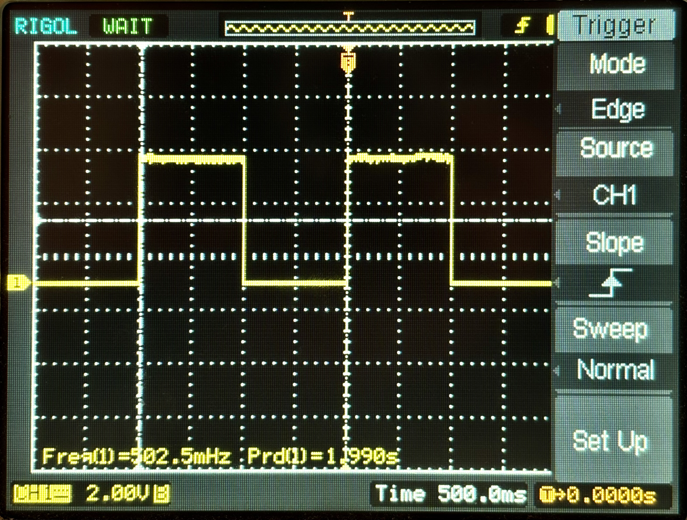

# Humanoid Sensors and Actuators  
# Tutorial 1 - Part 1

Course Instructors: Dr. Florian Bergner
hsa-lecture.ics@xcit.tum.de

Summer Semester 2026

## Initial Setup (Before the Tutorial!)

### Prepare PC

- Install one of the following operating systems:
  - Ubuntu 24.04 AMD64 (tested)
  - Ubuntu 22.04 AMD64 (supported)
  - Ubuntu 20.04 AMD64 (supported)

- We strongly recommend to have a native Ubuntu installation, we will not support a virtual machine, but you are free to use it
- Docker in Windows (WSL) or Docker in MacOS will NOT work
- If you do not have a native Ubuntu OS you can try to use VirtualBox
- We only support AMD64, ARM64 or other architectures (e.g. WIN ARM Surface, Apple M1, M2, M3 etc.) are NOT supported, even when running VirtualBox

### Install and Setup Docker

1. Uninstall old versions
2. Install using the apt repository (only steps 1 to 3, step 3: running the hello world image is optional)
3. Manage Docker as a non-root user

### Install and Setup VS Code

1. Install VS Code
2. https://marketplace.visualstudio.com/items?itemName=ms-vscode-remote.remote-containers

### Pull the Docker image

```bash
docker login "gitlab.lrz.de:5005"
docker pull "gitlab.lrz.de:5005/hsa/students/docker/avr/avr:focal-vscode"
docker tag "gitlab.lrz.de:5005/hsa/students/docker/avr/avr:focal-vscode" "avr:focal-vscode"
```

### Clone the tutorial project

```bash
git clone "https://gitlab.lrz.de/hsa/students/hsa_t1s1_ws.git"
```

### Install the udev rules for the programmer

We need to install `udev` rules on the Ubuntu OS to use the programmer without `sudo`. Open a Terminal and make sure you are in the tutorial project folder `hsa_t1s1_ws`.

```bash
cd hsa_t1s1_ws
sudo cp -v udev/97-ics-avr.rules /etc/udev/rules.d
sudo udevadm control --reload
```
If you have the programmer already connected you need to unplug and plug it.

### Open the tutorial project in the Dev Container

1. Remove any previously started Dev Containers of the project.
```bash
docker rm hsa_t1s1_ws_devcont
```
2. Open the tutorial project in VS Code:
```bash
cd hsa_t1s1_ws
code .
```
3. Press `Ctrl+Shift+P`, type `Dev Containers: Rebuild and Reopen In Container`, and press `Enter`. The project is now opened in the Dev Container and all terminals in VS Code will be running in the container environment.

4. After you built the Dev Container you can also open it later again with `Dev Containers: Reopen In Container` and skip the container building process.

## Oscilloscope

During our tutorials we will be using an oscilloscope to measure the analog signals of the microcontroller, if you are unfamiliar with oscilloscopes, research on oscilloscope basics. We recommend these tutorials as a good starting point:
https://learn.sparkfun.com/tutorials/how-to-use-an-oscilloscope/all

## Microcontrollers (MCUs): Introduction
In this first part of tutorial 1 we will learn:
- How to write and compile assembly and C code for the AVR MCU
- How to use the general purpose IO pins of AVR MCUs

## 1 Microcontroller Circuit (6 points)

### 1.1 Report (6 points)

**R.1.1(2 points)** What are decoupling capacitors? Please explain in detail why they are needed in circuits with MCUs.
```answer
type here the answer...
```
**R.1.2 (2 points)** What properties are important for good decoupling capacitors? Name at least two and explain.
```answer
type here the answer...
```
**R.1.3 (2 points)** Where would you place decoupling capacitors in a PCB layout. Explain why you would place them there.
```answer
type here the answer...
```
## 2 Programming the microcontroller: (9 points)

### 2.1 Finalize setup for programming the real AVR

You already installed all the required programs in the previous steps. Connect your board to your computer and finalize the setup with the following steps:

1. Open the tutorial project in VS Code:
```bash
cd hsa_t1s1_ws
code.
```
2. Press `Ctrl+Shift+P`, type `Dev Containers: Reopen In Container`, and press `Enter`.
   
3. Check if the connection to the AVR microcontroller is fine:
```bash
# read fuse bits (Default: lfuse=0xE1, hfuse=0x99): JTAG on, 1 MHz, internal clock
avrdude -c avrispmkII -P usb B10 -p atmega32 -n -U lfuse:r:-:b -U hfuse:r:-:b
```
4. Make sure that the AVR microcontroller has the correct settings:
```bash
# write fuse bits: JTAG off, internal clock @ 1 MHz: lfuse=0xE1, hfuse=0xC9
avrdude -c avrispmkII -P usb B10 -p atmega32 -U lfuse:w:0xE1:m -U hfuse:w:0xC9:m
```
5. *Optional*: Other fuse bit setting for higher CPU frequencies (Skip for now)
```bash
# write fuse bits: JTAG off, internal clock @ 1 MHz: lfuse=0xE1, hfuse=0xC9
avrdude -c avrispmkII -P usb B10 -p atmega32 -U lfuse:w:0xE1:m -U hfuse:w:0xC9:m
# write fuse bits: JTAG off, internal clock @ 2 MHz: lfuse=0xE2, hfuse=0xC9
avrdude -c avrispmkII -P usb B10 -p atmega32 -U lfuse:w:0xE2:m -U hfuse:w:0xC9:m
# write fuse bits: JTAG off, internal clock @ 4 MHz: lfuse=0xE3, hfuse=0xC9
avrdude -c avrispmkII -P usb B10 -p atmega32 -U lfuse:w:0xE3:m -U hfuse:w:0xC9:m
# write fuse bits: JTAG off, internal clock @ 8 MHz: lfuse=0xE4, hfuse=0xC9
avrdude -c avrispmkII -P usb B10 -p atmega32 -U lfuse:w:0xE4:m -U hfuse:w:0xC9:m
```

### 2.2 How to program your microcontroller
After building your project, a .hex file is generated inside the build folder of your project. This file is the one that we need to flash to our microcontroller.

- To manually flash a `.hex` file to the microcontroller, run in a terminal inside the folder where the `.hex` file is:
```bash
cd hex
# flash the program blink.hex
avrdude -c avrispmkII -P usb B10 -p atmega32 -U flash:w:blink.hex
```
- After building you can also execute the make target `prog_<app-name>`:
```bash
cd hsa_t1s1_ws
mkdir -p build
cd build
cmake..
make
make prog_asm_blink
```

- To manually erase the microcontroller:
```bash
avrdude -c avrispmkII -P usb B10 -p atmega32 -e
```

### 2.3 Blinking a LED (9 points)
1. Program the microcontroller using the `.hex` file. You should see one LED blinking.
```bash
cd hsa_t1s1_ws
cd hex
# flash the program blink.hex
avrdude -c avrispmkII -P usb B10 -p atmega32 -U flash:w:blink.hex
```
**T.2.1 (2 points)** Use the oscilloscope to measure the pin `PC0` (Remember to connect it between the LED and ground (GND)). Configure your oscilloscope to have 2V/div and 500.00ms/div. Submit a picture of it named `blink_trace.png`



**R.2.1 (2 points)** Your oscilloscope has different trigger modes. What do the different trigger modes mean? What does the trigger level and source mean?
```answer
type here the answer...
```
**R.2.2 (2 points)** Your oscilloscope has also different sweep types. Explain the different sweep types and their use cases.
```answer
type here the answer...
```
**R.2.3 (3 points)** What happens when you change the trigger mode in your reading from T2.1? When do you change the slope type? When do you change the sweep type? What is the best trigger configuration for this reading? Explain why.
```answer
type here the answer...
```
## 3 Using the GPIO Peripherial Block (60 points)

### 3.1 Setting Pin Levels in Assembly (20 points)
Please use the tutorial project `hsa_t1s1_ws` as basis for the tasks introduced in this section.
Please submit the code you created as specified in the tasks.
You can find template files for each task in the folder `hsa_t1s1_ws/src/gpio_asm/src/applications`.
For this tutorial you will need to use the documentation of the AVR microcontroller that we are using.
You can find it in the folder `hsa_t1s1_ws/docs`.

**T.3.1 (4 points)** Write an assembly program which lets the LED on `PORTC` on pin `PC0` blink.
The LED should stay on for one second and stay off for one second. Please use the code fragment of `Listing 1` to generate a delay of one second.
You submit the file `main_asm_blink.S` which contains the main function of your assembly program and your solution for this task.
```asm
; wait for one second
    ldi r18, 0x3F
    ldi r24, 0x0D
    ldi r25, 0x03
1:  subi r18, 0x01
    sbci r24, 0x00
    sbci r25, 0x00
    brne 1b        ; local label backward
    rjmp 1f        ; local label forward
1:  nop
```
**T.3.2 (2 points)** Your program of T.3.1 avoids changing the bits of other pins on `PORTC`.
```asm
#include <atmega32/asm/io.h>

.global main

main:
    in r18, DDRC
    ori r18, 0x01
    out DDRC, r18

loop:
    sbi PORTC, 0
    rcall delay
    cbi PORTC, 0
    rcall delay
    rjmp loop

    ret                         ; exit, should never be reached

delay:
    ldi r18, 0x3F
    ldi r24, 0x0D
    ldi r25, 0x03
1:  subi r18, 0x01
    sbci r24, 0x00
    sbci r25, 0x00
    brne 1b ; local label backward
    rjmp 1f ; local label forward
1:  nop
    ret

.end
```

**T.3.3 (4 points)** Write an assembly program which turns the three LEDs on pins `PC0`, `PC1`, and `PC2` on and off with a delay of one second continuously in the following sequence:
    
    Step 1 : PC0 on, PC1 off, PC2 off
    Step 2 : PC0 off, PC1 on, PC2 off
    Step 3 : PC0 off, PC1 off, PC2 on

You submit the file `main_asm_blink3.S` which contains the main function of your assembly program and your solution for this task.
```asm
#include <atmega32/asm/io.h>

.global main

main:
    in r18, DDRC
    ori r18, 0x07
    out DDRC, r18

loop:
    sbi PORTC, 0
    cbi PORTC, 1
    cbi PORTC, 2
    rcall delay

    cbi PORTC, 0
    sbi PORTC, 1
    cbi PORTC, 2
    rcall delay

    cbi PORTC, 0
    cbi PORTC, 1
    sbi PORTC, 2
    rcall delay

    rjmp loop

    ret                         ; exit, should never be reached


delay:
    ldi r18, 0x3F
    ldi r24, 0x0D
    ldi r25, 0x03
1:  subi r18, 0x01
    sbci r24, 0x00
    sbci r25, 0x00
    brne 1b ; local label backward
    rjmp 1f ; local label forward
1:  nop
    ret

.end
```
**T.3.4 (Bonus) (4 points)** Using your oscilloscope visualize the three signals at the same time (using three different channels).
Submit a picture of it named `blink3_trace.png`

**T.3.5 (2 points)** Your program of **T.3.3** avoids changing the bits of other pins on `PORTC`.

**T.3.6 (4 points)** Find the most efficient set of assembly instructions such that changing the pin levels in each step of T.3.3 only takes in sum 4 CPU cycles.
You will get only points if your set of instructions does not manipulate the bits of other pins on `PORTC`.
You submit the file `main_asm_blink3_eff.S` which contains the main function of your assembly program and your solution for this task.
Please add comments to your code why you believe that your set of instructions only takes 4 CPU cycles.
```asm
#include <atmega32/asm/io.h>

.global main

main:
    in r18, DDRC
    ori r18, 0x07
    out DDRC, r18

loop:
    in r18, PORTC
    andi r18, 0xF8
    ori r18, 0x01
    out PORTC, r18
    rcall delay

    in r18, PORTC
    andi r18, 0xF8
    ori r18, 0x02
    out PORTC, r18
    rcall delay

    in r18, PORTC
    andi r18, 0xF8
    ori r18, 0x04
    out PORTC, r18
    rcall delay

    rjmp loop

    ret                         ; exit, should never be reached


delay:
    ldi r18, 0x3F
    ldi r24, 0x0D
    ldi r25, 0x03
1:  subi r18, 0x01
    sbci r24, 0x00
    sbci r25, 0x00
    brne 1b ; local label backward
    rjmp 1f ; local label forward
1:  nop
    ret

.end
```

## 3.2 Setting Pin Levels in C (6 points)
Please use the tutorial project `hsa_t1s1_ws` as basis for the tasks introduced in this section.
Please submit the code you created as specified in the tasks.
You can find template files for each task in the folder `hsa_t1s1_ws/src/gpio_c/src/applications`.

**T.3.7 (2 points)** Implement **T.3.1** using C code. You submit the file `main_blink.c` which contains the main function of your program and your solution for this task.
```c
// Get register definitions with auto complete
#include <atmega32/io.h>

// For delay functions: F_CPU has to be defined
#include <util/delay.h>


int main (void)
{
    DDRC |= 0x01;

    while(1){
        PORTC |= (1 << PC0);
        _delay_ms(1000);
        PORTC &= ~(1 << PC0);
        _delay_ms(1000);
    }
    // Should never be reached
    return 0;
}
```

**T.3.8 (1 point)** Your program of **T.3.7** avoids changing the bits of other pins on `PORTC`.

**T.3.9 (2 points)** Implement **T.3.3** using C code. You submit the file `main_blink3.c` which contains the main function of your program and your solution for this task.
```c
// Get register definitions with auto complete
#include <atmega32/io.h>

// For delay functions: F_CPU has to be defined
#include <util/delay.h>


int main (void)
{
    DDRC |= 0x07;

    while(1){
        PORTC &= ~(1 << PC0 | 1 << PC1 | 1 << PC2);
        PORTC |= (1 << PC0);
        _delay_ms(1000);
        PORTC &= ~(1 << PC0 | 1 << PC1 | 1 << PC2);
        PORTC |= (1 << PC1);
        _delay_ms(1000);
        PORTC &= ~(1 << PC0 | 1 << PC1 | 1 << PC2);
        PORTC |= (1 << PC2);
        _delay_ms(1000);
    }
    // Should never be reached
    return 0;
}
```

**T.3.10 (1 point)** Your program of **T.3.9** avoids changing the bits of other pins on `PORTC`.

## 3.3 Reading Pin Levels in Assembly and C (8 points)
Please use the respective template files introduced in the previous sections as basis for the following tasks.

**T.3.11 (4 points)** Write an assembly program that mirrors (copies) the input of pin `PC4` to pin `PC3`. Delay the input by one second using the delay code of `Listing 1`. You submit the file `main_asm_mirror.S` which contains the main function of your program and your solution for this task.
```asm
#include <atmega32/asm/io.h>

.global main

main:
    in r19, DDRC
    ori r19, 0x08
    andi r19, 0xEF
    out DDRC, r19

loop:
    ; read on pin 4
    in r19, PINC
    andi r19, 0x10
    lsr r19
    
    ; delay
    rcall delay

    ; mirror on pin 3
    in r18, PORTC
    andi r18, 0xF7
    or r18, r19
    out PORTC, r18
    
    rjmp loop

    ret                         ; exit, should never be reached

delay:
    ldi r18, 0x3F
    ldi r24, 0x0D
    ldi r25, 0x03
1:  subi r18, 0x01
    sbci r24, 0x00
    sbci r25, 0x00
    brne 1b ; local label backward
    rjmp 1f ; local label forward
1:  nop
    ret

.end
```

**T.3.12 (1 point)** Your program of **T.3.11** avoids changing the bits of other pins on `PORTC`.

**T.3.13 (2 points)** Implement **T.3.11** using C code. You submit the file `main_mirror.c` which contains the main function of your program and your solution for this task.
```c
// Get register definitions with auto complete
#include <atmega32/io.h>

// For delay functions: F_CPU has to be defined
#include <util/delay.h>


int main (void)
{
    DDRC |= (1 << PC3); 
    DDRC &= ~(1 << PC4);

    uint8_t temp;

    while(1){
        temp = (PINC >> PC4) & 1;
        
        _delay_ms(1000);
        if(temp) PORTC |= (1 << PC3);
        else PORTC &= ~(1 << PC3);
    }

    // Should never be reached
    return 0;
}
```

**T.3.14 (1 point)** Your program of **T.3.13** avoids changing the bits of other pins on `PORTC`.

## 3.4 Report (26 points)

**R.3.1 (4 points)** How can you ensure that the logic levels of 4 pins are changed at exactly the same time without changing the other pins on the port? Provide an example in assembly code where you set the two pins `PC0` and `PC1` to high and the two pins `PC2` and `PC3` to low at the same time (CPU cycle).
```answer
type here the answer...
```

**R.3.2 (2 points)** Can you change the logic level of 2 pins of 2 different ports at the same time? Justify your answer by providing an example.
```answer
type here the answer...
```

**R.3.3 (6 points)** Explain each line of assembly code in `Listing 1`. For each correct explanation you get a point for lines 2-3, line 4, lines 6-7, line 8, line 9, and line 10.
```answer
type here the answer...
```

**R.3.4 (4 points)** Explain and calculate why the code fragment of `Listing 1` takes exactly (not approximately) one second when the CPU is running at 1 MHz.
```answer
type here the answer...
```

**R.3.5 (1 point)** What are the main disadvantages of busy waiting, even when we can achieve delays with very high accuracy?
```answer
type here the answer...
```

**R.3.6 (1 point)** In **R.3.4** you calculated that the code fragment of `Listing 1` takes exactly one second when the CPU is running at 1 MHz. However, in certain cases this code fragment will consume more CPU cycles than calculated in *R.3.4*. Please explain when this is the case.
```answer
type here the answer...
```

**R.3.7 (1 point)** Why does the MCU implement two address spaces for data and registers and two sets of assembly instructions (IN/OUT and LD/ST) to access these address spaces? Please explain and justify your answer.
```answer
type here the answer...
```

**R.3.8 (1 point)** Provide an example where you once use OUT and then ST to write the value `0xAC` to the peripheral register `PORTD`. Please look up the addresses of `PORTD` in the datasheet of the MCU.
```answer
type here the answer...
```

**R.3.9 (2 points)** How many CPU cycles are needed to load the address of PORTD and then write the value `0xAC` to the register `PORTD` when using OUT and when using ST?
```answer
type here the answer...
```

**R.3.10 (4 points)** Given a peripheral register with an address `0x15`, how can you create a variable in C that allows you to read/write this register without using the device support headers? (Hint: You will need to use type conversions.)
```answer
type here the answer...
```
# Tutorial 1 - Part 2

## Microcontrollers (MCUs): Serial Communication - UART

In this second part of tutorial 1 we will have a look at the asynchronous serial communication interface called UART and the corresponding UART peripheral block of the AVR microcontroller. UART stands for universal asynchronous receiver-transmitter. Peripheral devices, such as MCUs, that support UART can be connected to the serial ports of computers. Thus, peripheral devices that support UART can easily establish a serial communication with computers. Nowadays, most computers no longer provide serial ports especially since USB gained popularity. However, many USB-to-serial converters are available on the market. Of these USB-to-serial converters the FTDI converters are maybe the most popular and well-known converters and are supported by almost all hardware and software systems.

In this tutorial we will learn:

- How to use the UART peripheral of the AVR MCU
- How to receive information from and send information to the PC

## Initial Setup (Before the Tutorial!)

### Pull the updated Docker image

You need to pull the updated Docker image. The docker image you pulled in tutorial session 1 part 1 is outdated.

```bash
# Pull image
docker login"gitlab.lrz.de:5005"
docker pull"gitlab.lrz.de:5005/hsa/students/docker/avr/avr:focal-vscode"
docker tag"gitlab.lrz.de:5005/hsa/students/docker/avr/avr:focal-vscode/avr:focal-vscode"
```

### Clone the tutorial project
```bash
git clone "https://gitlab.lrz.de/hsa/students/hsa_t1s2_ws.git"
```

### Install the udev rules for the FTDI serial port device
We need to install `udev` rules on the Ubuntu OS to use the FTDI device. Open a Terminal and make sure you are in the tutorial project folder `hsa_t1s2_ws`.

```bash
cd hsa_t1s2_ws
# install the udev rule
sudo cp -v udev/97-ics-fi1200.rules /etc/udev/rules.d
# reload the rule
sudo udevadm control --reload
```

If you have the FTDI device already connected you need to unplug and plug it.

### Open the tutorial project in the Dev Container
1. Remove any previously started Dev Containers of the project.
```bash
docker rm hsa_t1s2_ws_devcont
```

2. Open the tutorial project in VS Code:
```bash
cd hsa_t1s2_ws
code .
```

3. Press `Ctrl+Shift+P`, type `Dev Containers: Rebuild and Reopen In Container`, and press `Enter`. The project is now opened in the Dev Container and all terminals in VS Code will be running in the container environment.

4. After you built the Dev Container you can also open it later again with
`Dev Containers: Reopen In Container` and skip the container building process.

## 4 Using the UART Peripheral Block (22 points)

### 4.1 Testing UART communication (2 points)
Program your microcontroller with the file uart_hello_world.hex:
```bash
cd hsa_t1s2_ws
cd hex
# flash the program uart_hello_world.hex
avrdude -c avrispmkII -P usb B10 -p atmega32 -U flash:w:uart_hello_world.hex
````

Connect the FTDI device to the UART port of the microcontroller. Check the schematic provided in tutorial 1 part 1.

Then launch the Python script that connects to the FTDI device and observe the printout:

```bash
cd hsa_t1s2_ws
cd src/uart
# run the python script, you can exit it by pressing ’q’ and then ’Enter’.
./uart.py
```

Now program your microcontroller with the file `uart_echo.hex`. Run the Python script `uart.py` and type w and press `Enter`. You can modify the Python script to send different messages.

**T.4.0 (2 points)** What happens when you send a string? What is the microcontroller doing?
```answer
the microcontroller reads the message and sends it back
```

## 4.2 Sending and Receiving Information with the UART (12 points)
Please use the tutorial project `hsa_t1s2_ws` as basis for the tasks introduced in this section. 
Please submit the code you created as specified in the tasks. 
You can find template files for each task in the folder `hsa_t1s2_ws/src/uart/src/applications`.

***T.4.1 (8 points)*** Consult the data sheet Atmega32.pdf (`hsa_t1s2_ws/docs/`) of the AVR Atmega32.
Implement your own echo program in C considering the following instructions:
- The CPU frequency is set to 1 MHz (this is the standard configuration in simulation and you should not need to change anything)
- You don’t use the double transmission speed flag (bit U2X)
- You use blocking functions for your implementation, i.e. you don’t use interrupts etc. You busy wait until the byte is received or sent
- You use the format `8N1`, that is
  * Asynchronous communication
  * 1 start bit
  * 8 data bits
  * No parity bit
  * 1 stop bit
- You calculate the 16-bit value for the UBRR register such that you configure a baudrate of 62500 Baud

The echo program waits until one byte has been received and then sends the same byte back to the computer. 
You submit the file `main_uart_echo.c` which contains the main function, other functions of your program, and your solution for this task. We will not accept copy and paste solutions taken from the Internet.
