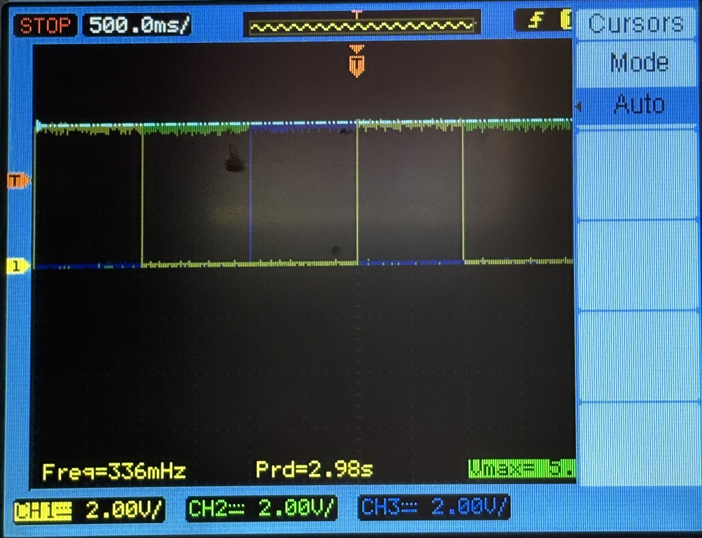

# Humanoid Sensors and Actuators  
# Tutorial 1 - Part 1

Course Instructors: Dr. Florian Bergner
hsa-lecture.ics@xcit.tum.de

Summer Semester 2026

## Initial Setup (Before the Tutorial!)

### Prepare PC

- Install one of the following operating systems:
  - Ubuntu 24.04 AMD64 (tested)
  - Ubuntu 22.04 AMD64 (supported)
  - Ubuntu 20.04 AMD64 (supported)

- We strongly recommend to have a native Ubuntu installation, we will not support a virtual machine, but you are free to use it
- Docker in Windows (WSL) or Docker in MacOS will NOT work
- If you do not have a native Ubuntu OS you can try to use VirtualBox
- We only support AMD64, ARM64 or other architectures (e.g. WIN ARM Surface, Apple M1, M2, M3 etc.) are NOT supported, even when running VirtualBox

### Install and Setup Docker

1. Uninstall old versions
2. Install using the apt repository (only steps 1 to 3, step 3: running the hello world image is optional)
3. Manage Docker as a non-root user

### Install and Setup VS Code

1. Install VS Code
2. https://marketplace.visualstudio.com/items?itemName=ms-vscode-remote.remote-containers

### Pull the Docker image

```bash
docker login "gitlab.lrz.de:5005"
docker pull "gitlab.lrz.de:5005/hsa/students/docker/avr/avr:focal-vscode"
docker tag "gitlab.lrz.de:5005/hsa/students/docker/avr/avr:focal-vscode" "avr:focal-vscode"
```

### Clone the tutorial project

```bash
git clone "https://gitlab.lrz.de/hsa/students/hsa_t1s1_ws.git"
```

### Install the udev rules for the programmer

We need to install `udev` rules on the Ubuntu OS to use the programmer without `sudo`. Open a Terminal and make sure you are in the tutorial project folder `hsa_t1s1_ws`.

```bash
cd hsa_t1s1_ws
sudo cp -v udev/97-ics-avr.rules /etc/udev/rules.d
sudo udevadm control --reload
```
If you have the programmer already connected you need to unplug and plug it.

### Open the tutorial project in the Dev Container

1. Remove any previously started Dev Containers of the project.
```bash
docker rm hsa_t1s1_ws_devcont
```
2. Open the tutorial project in VS Code:
```bash
cd hsa_t1s1_ws
code .
```
3. Press `Ctrl+Shift+P`, type `Dev Containers: Rebuild and Reopen In Container`, and press `Enter`. The project is now opened in the Dev Container and all terminals in VS Code will be running in the container environment.

4. After you built the Dev Container you can also open it later again with `Dev Containers: Reopen In Container` and skip the container building process.

## Oscilloscope

During our tutorials we will be using an oscilloscope to measure the analog signals of the microcontroller, if you are unfamiliar with oscilloscopes, research on oscilloscope basics. We recommend these tutorials as a good starting point:
https://learn.sparkfun.com/tutorials/how-to-use-an-oscilloscope/all

## Microcontrollers (MCUs): Introduction
In this first part of tutorial 1 we will learn:
- How to write and compile assembly and C code for the AVR MCU
- How to use the general purpose IO pins of AVR MCUs

## 1 Microcontroller Circuit (6 points)

### 1.1 Report (6 points)

**R.1.1(2 points)** What are decoupling capacitors? Please explain in detail why they are needed in circuits with MCUs.
```answer
type here the answer...
```
**R.1.2 (2 points)** What properties are important for good decoupling capacitors? Name at least two and explain.
```answer
type here the answer...
```
**R.1.3 (2 points)** Where would you place decoupling capacitors in a PCB layout. Explain why you would place them there.
```answer
type here the answer...
```
## 2 Programming the microcontroller: (9 points)

### 2.1 Finalize setup for programming the real AVR

You already installed all the required programs in the previous steps. Connect your board to your computer and finalize the setup with the following steps:

1. Open the tutorial project in VS Code:
```bash
cd hsa_t1s1_ws
code.
```
2. Press `Ctrl+Shift+P`, type `Dev Containers: Reopen In Container`, and press `Enter`.
   
3. Check if the connection to the AVR microcontroller is fine:
```bash
# read fuse bits (Default: lfuse=0xE1, hfuse=0x99): JTAG on, 1 MHz, internal clock
avrdude -c avrispmkII -P usb B10 -p atmega32 -n -U lfuse:r:-:b -U hfuse:r:-:b
```
4. Make sure that the AVR microcontroller has the correct settings:
```bash
# write fuse bits: JTAG off, internal clock @ 1 MHz: lfuse=0xE1, hfuse=0xC9
avrdude -c avrispmkII -P usb B10 -p atmega32 -U lfuse:w:0xE1:m -U hfuse:w:0xC9:m
```
5. *Optional*: Other fuse bit setting for higher CPU frequencies (Skip for now)
```bash
# write fuse bits: JTAG off, internal clock @ 1 MHz: lfuse=0xE1, hfuse=0xC9
avrdude -c avrispmkII -P usb B10 -p atmega32 -U lfuse:w:0xE1:m -U hfuse:w:0xC9:m
# write fuse bits: JTAG off, internal clock @ 2 MHz: lfuse=0xE2, hfuse=0xC9
avrdude -c avrispmkII -P usb B10 -p atmega32 -U lfuse:w:0xE2:m -U hfuse:w:0xC9:m
# write fuse bits: JTAG off, internal clock @ 4 MHz: lfuse=0xE3, hfuse=0xC9
avrdude -c avrispmkII -P usb B10 -p atmega32 -U lfuse:w:0xE3:m -U hfuse:w:0xC9:m
# write fuse bits: JTAG off, internal clock @ 8 MHz: lfuse=0xE4, hfuse=0xC9
avrdude -c avrispmkII -P usb B10 -p atmega32 -U lfuse:w:0xE4:m -U hfuse:w:0xC9:m
```

### 2.2 How to program your microcontroller
After building your project, a .hex file is generated inside the build folder of your project. This file is the one that we need to flash to our microcontroller.

- To manually flash a `.hex` file to the microcontroller, run in a terminal inside the folder where the `.hex` file is:
```bash
cd hex
# flash the program blink.hex
avrdude -c avrispmkII -P usb B10 -p atmega32 -U flash:w:blink.hex
```
- After building you can also execute the make target `prog_<app-name>`:
```bash
cd hsa_t1s1_ws
mkdir -p build
cd build
cmake..
make
make prog_asm_blink
```

- To manually erase the microcontroller:
```bash
avrdude -c avrispmkII -P usb B10 -p atmega32 -e
```

### 2.3 Blinking a LED (9 points)
1. Program the microcontroller using the `.hex` file. You should see one LED blinking.
```bash
cd hsa_t1s1_ws
cd hex
# flash the program blink.hex
avrdude -c avrispmkII -P usb B10 -p atmega32 -U flash:w:blink.hex
```
**T.2.1 (2 points)** Use the oscilloscope to measure the pin `PC0` (Remember to connect it between the LED and ground (GND)). Configure your oscilloscope to have 2V/div and 500.00ms/div. Submit a picture of it named `blink_trace.png`


**R.2.1 (2 points)** Your oscilloscope has different trigger modes. What do the different trigger modes mean? What does the trigger level and source mean?
```answer
type here the answer...
```
**R.2.2 (2 points)** Your oscilloscope has also different sweep types. Explain the different sweep types and their use cases.
```answer
type here the answer...
```
**R.2.3 (3 points)** What happens when you change the trigger mode in your reading from T2.1? When do you change the slope type? When do you change the sweep type? What is the best trigger configuration for this reading? Explain why.
```answer
type here the answer...
```
## 3 Using the GPIO Peripherial Block (60 points)

### 3.1 Setting Pin Levels in Assembly (20 points)
Please use the tutorial project `hsa_t1s1_ws` as basis for the tasks introduced in this section.
Please submit the code you created as specified in the tasks.
You can find template files for each task in the folder `hsa_t1s1_ws/src/gpio_asm/src/applications`.
For this tutorial you will need to use the documentation of the AVR microcontroller that we are using.
You can find it in the folder `hsa_t1s1_ws/docs`.

**T.3.1 (4 points)** Write an assembly program which lets the LED on `PORTC` on pin `PC0` blink.
The LED should stay on for one second and stay off for one second. Please use the code fragment of `Listing 1` to generate a delay of one second.
You submit the file `main_asm_blink.S` which contains the main function of your assembly program and your solution for this task.
```asm
; wait for one second
    ldi r18, 0x3F
    ldi r24, 0x0D
    ldi r25, 0x03
1:  subi r18, 0x01
    sbci r24, 0x00
    sbci r25, 0x00
    brne 1b        ; local label backward
    rjmp 1f        ; local label forward
1:  nop
```
**T.3.2 (2 points)** Your program of T.3.1 avoids changing the bits of other pins on `PORTC`.
```asm
#include <atmega32/asm/io.h>

.global main

main:
    in r18, DDRC
    ori r18, 0x01
    out DDRC, r18

loop:
    sbi PORTC, 0
    rcall delay
    cbi PORTC, 0
    rcall delay
    rjmp loop
...
```
See [full code](code/main_asm_blink.S) ↗

**T.3.3 (4 points)** Write an assembly program which turns the three LEDs on pins `PC0`, `PC1`, and `PC2` on and off with a delay of one second continuously in the following sequence:
    
    Step 1 : PC0 on, PC1 off, PC2 off
    Step 2 : PC0 off, PC1 on, PC2 off
    Step 3 : PC0 off, PC1 off, PC2 on

You submit the file `main_asm_blink3.S` which contains the main function of your assembly program and your solution for this task.
```asm
#include <atmega32/asm/io.h>

.global main

main:
    in r18, DDRC
    ori r18, 0x07
    out DDRC, r18

loop:
    sbi PORTC, 0
    cbi PORTC, 1
    cbi PORTC, 2
    rcall delay

    cbi PORTC, 0
    sbi PORTC, 1
    cbi PORTC, 2
    rcall delay

    cbi PORTC, 0
    cbi PORTC, 1
    sbi PORTC, 2
    rcall delay

    rjmp loop

    ret                         ; exit, should never be reached
...
```
See [full code](code/main_asm_blink3.S) ↗

**T.3.4 (Bonus) (4 points)** Using your oscilloscope visualize the three signals at the same time (using three different channels).
Submit a picture of it named `blink3_trace.png`



**T.3.5 (2 points)** Your program of **T.3.3** avoids changing the bits of other pins on `PORTC`.

**T.3.6 (4 points)** Find the most efficient set of assembly instructions such that changing the pin levels in each step of T.3.3 only takes in sum 4 CPU cycles.
You will get only points if your set of instructions does not manipulate the bits of other pins on `PORTC`.
You submit the file `main_asm_blink3_eff.S` which contains the main function of your assembly program and your solution for this task.
Please add comments to your code why you believe that your set of instructions only takes 4 CPU cycles.
```asm
#include <atmega32/asm/io.h>

.global main

main:
    in r18, DDRC
    ori r18, 0x07
    out DDRC, r18

loop:
    in r18, PORTC
    andi r18, 0xF8
    ori r18, 0x01
    out PORTC, r18
    rcall delay

    in r18, PORTC
    andi r18, 0xF8
    ori r18, 0x02
    out PORTC, r18
    rcall delay

    in r18, PORTC
    andi r18, 0xF8
    ori r18, 0x04
    out PORTC, r18
    rcall delay

    rjmp loop

    ret                         ; exit, should never be reached
...
```
See [full code](code/main_asm_blink3_eff.S) ↗

## 3.2 Setting Pin Levels in C (6 points)
Please use the tutorial project `hsa_t1s1_ws` as basis for the tasks introduced in this section.
Please submit the code you created as specified in the tasks.
You can find template files for each task in the folder `hsa_t1s1_ws/src/gpio_c/src/applications`.

**T.3.7 (2 points)** Implement **T.3.1** using C code. You submit the file `main_blink.c` which contains the main function of your program and your solution for this task.
```c
// Get register definitions with auto complete
#include <atmega32/io.h>

// For delay functions: F_CPU has to be defined
#include <util/delay.h>


int main (void)
{
    DDRC |= (1 << PC0);

    while(1){
        PORTC |= (1 << PC0);
        _delay_ms(1000);
        PORTC &= ~(1 << PC0);
        _delay_ms(1000);
    }
    // Should never be reached
    return 0;
}
```
See [code](code/main_blink.c) ↗

**T.3.8 (1 point)** Your program of **T.3.7** avoids changing the bits of other pins on `PORTC`.

**T.3.9 (2 points)** Implement **T.3.3** using C code. You submit the file `main_blink3.c` which contains the main function of your program and your solution for this task.
```c
// Get register definitions with auto complete
#include <atmega32/io.h>

// For delay functions: F_CPU has to be defined
#include <util/delay.h>


int main (void)
{
    DDRC |= (1 << PC0 | 1 << PC1 | 1 << PC2);

    while(1){
        PORTC &= ~(1 << PC0 | 1 << PC1 | 1 << PC2);
        PORTC |= (1 << PC0);
        _delay_ms(1000);
        PORTC &= ~(1 << PC0 | 1 << PC1 | 1 << PC2);
        PORTC |= (1 << PC1);
        _delay_ms(1000);
        PORTC &= ~(1 << PC0 | 1 << PC1 | 1 << PC2);
        PORTC |= (1 << PC2);
        _delay_ms(1000);
    }
    // Should never be reached
    return 0;
}
```
See [code](code/main_blink3.c) ↗

**T.3.10 (1 point)** Your program of **T.3.9** avoids changing the bits of other pins on `PORTC`.

## 3.3 Reading Pin Levels in Assembly and C (8 points)
Please use the respective template files introduced in the previous sections as basis for the following tasks.

**T.3.11 (4 points)** Write an assembly program that mirrors (copies) the input of pin `PC4` to pin `PC3`. Delay the input by one second using the delay code of `Listing 1`. You submit the file `main_asm_mirror.S` which contains the main function of your program and your solution for this task.
```asm
#include <atmega32/asm/io.h>

.global main

main:
    in r19, DDRC
    ori r19, 0x08
    andi r19, 0xEF
    out DDRC, r19

loop:
    ; read on pin 4
    in r19, PINC
    andi r19, 0x10
    lsr r19
    
    ; delay
    rcall delay

    ; mirror on pin 3
    in r18, PORTC
    andi r18, 0xF7
    or r18, r19
    out PORTC, r18
    
    rjmp loop

    ret                         ; exit, should never be reached
...
```
See [full code](code/main_asm_mirror.S) ↗

**T.3.12 (1 point)** Your program of **T.3.11** avoids changing the bits of other pins on `PORTC`.

**T.3.13 (2 points)** Implement **T.3.11** using C code. You submit the file `main_mirror.c` which contains the main function of your program and your solution for this task.
```c
// Get register definitions with auto complete
#include <atmega32/io.h>

// For delay functions: F_CPU has to be defined
#include <util/delay.h>
#define F_CPU 1000000UL

int main (void)
{
    DDRC |= (1 << PC3); 
    DDRC &= ~(1 << PC4);

    unsigned char temp;

    while(1){
        temp = (PINC >> PC4) & 1;
        
        _delay_ms(1000);
        if(temp) PORTC |= (1 << PC3);
        else PORTC &= ~(1 << PC3);
    }

    // Should never be reached
    return 0;
}
```
See [code](code/main_mirror.c) ↗

**T.3.14 (1 point)** Your program of **T.3.13** avoids changing the bits of other pins on `PORTC`.

## 3.4 Report (26 points)

**R.3.1 (4 points)** How can you ensure that the logic levels of 4 pins are changed at exactly the same time without changing the other pins on the port? Provide an example in assembly code where you set the two pins `PC0` and `PC1` to high and the two pins `PC2` and `PC3` to low at the same time (CPU cycle).
```answer
By doing a single atomic write to PORTC.

in r18, PORTC
andi r18, 0xF0  ; clear pins that need to be changed
ori r18, 0x03   ; assign the desired values
out PORTC, r18  ; all the pins are updated toghether
```

**R.3.2 (2 points)** Can you change the logic level of 2 pins of 2 different ports at the same time? Justify your answer by providing an example.
```answer
No, you can't. AVR out instructions target one I/O register at a time, therefore you need to change them sequentially.

sbi PORTC, 0
sbi PORTD, 1

These instructions execute one after another, so the pins cannot change in the same CPU cycle
```

**R.3.3 (6 points)** Explain each line of assembly code in `Listing 1`. For each correct explanation you get a point for lines 2-3, line 4, lines 6-7, line 8, line 9, and line 10.
```answer
; wait for one second
    ldi r18, 0x3F   ; load lower byte of 3-byte value 0x030D3F into r18
    ldi r24, 0x0D   ; load middle byte of 3-byte value 0x030D3F into r24
    ldi r25, 0x03   ; load upper byte of 3-byte value 0x030D3F into r25
1:  subi r18, 0x01  ; create a local label and subtract 1 from register r18
    sbci r24, 0x00  ; subtract the carry generated by previous subtraction (if present) from r24
    sbci r25, 0x00  ; subtract the carry generated by previous subtraction (if present) from r25
    brne 1b         ; if result != 0, jump to previous label 1
    rjmp 1f         ; jump forward to next label 1
1:  nop             ; final instruction (end of delay loop)
```

**R.3.4 (4 points)** Explain and calculate why the code fragment of `Listing 1` takes exactly (not approximately) one second when the CPU is running at 1 MHz.
```answer
The first 3 instructions (3 CPU cycles) load the 3-byte value 0x030D3F, which correspond to 199999.
Then the loop subtract every time 1 from the register, ending once it reaches 0.
brne takes two CPU cycles if it jumps (1 otherwise), therefore each execution of the loop where the 3-byte value != 0 takes 3 + 2 = 5 CPU cycles, for a total of 199998 * 5 = 999990 CPU cycles.
Once the value reaches 0, brne takes only 1 CPU cycle, for a total of 4 CPU cycles in the last loop.
The last two instructions take a total of 3 CPU cycles (2 for rjmp and 1 for nop).
The sum of everything is 3 + 9999990 + 4 + 3 = 1000000 CPU cycles.
If the CPU runs at 1MHz it means that it will do 1 million CPU cycles in exactly one second.
```

**R.3.5 (1 point)** What are the main disadvantages of busy waiting, even when we can achieve delays with very high accuracy?
```answer
- It uses all the CPU power while doing nothing. This wastes a lot of energy and doesn't allow the CPU to execute other background tasks in the meantime. 
- It is not reliable because it can be interrupted by an interrupt. 
- It is based on the CPU frequency, making the code not portable on another device running at a different frequency.
```

**R.3.6 (1 point)** In **R.3.4** you calculated that the code fragment of `Listing 1` takes exactly one second when the CPU is running at 1 MHz. However, in certain cases this code fragment will consume more CPU cycles than calculated in *R.3.4*. Please explain when this is the case.
```answer
This can happen if the CPU pauses the loop to execute an Interrupt Service Routine, adding those instructions to the total number of instruction executed during the busy waiting.
```

**R.3.7 (1 point)** Why does the MCU implement two address spaces for data and registers and two sets of assembly instructions (IN/OUT and LD/ST) to access these address spaces? Please explain and justify your answer.
```answer
IN/OUT instructions are highly efficient because they take just one CPU cycle. However, they can only reach the I/O register file, wich is small. In contrast LD/ST instructions are more flexible and can access the entire SRAM data space, but they are slower, taking 2 CPU cycles.
```

**R.3.8 (1 point)** Provide an example where you once use OUT and then ST to write the value `0xAC` to the peripheral register `PORTD`. Please look up the addresses of `PORTD` in the datasheet of the MCU.
```answer
; out directly accesses the I/O register at 0x12, while st treats PORTD as a location in the general data memory at 0x32

ldi r16, 0xAC
out 0x12, r16    ; Write r16 to PORTD (I/O address 0x12)

ldi r16, 0xAC
ldi r26, 0x32    ; Load the memory address of PORTD (0x32) into XL (r26)
ldi r27, 0x00    ; Load the high byte of the address into XH (r27)
st X, r16        ; Store the value in r16 to the address pointed to by X (0x32)
```

**R.3.9 (2 points)** How many CPU cycles are needed to load the address of PORTD and then write the value `0xAC` to the register `PORTD` when using OUT and when using ST?
```answer
out ->  2 CPU cycle
st  ->  5 CPU cycle (4 instructions, but st takes 2 cycles)
```

**R.3.10 (4 points)** Given a peripheral register with an address `0x15`, how can you create a variable in C that allows you to read/write this register without using the device support headers? (Hint: You will need to use type conversions.)
```answer
By casting the address to a volatile pointer and then dereferencing it.
#define MYPORT *(volatile uint8_t *) 0x15
int main(){
    MYPORT = 0xFF; //how to use it
}
```

# Tutorial 1 - Part 2

## Microcontrollers (MCUs): Serial Communication - UART

In this second part of tutorial 1 we will have a look at the asynchronous serial communication interface called UART and the corresponding UART peripheral block of the AVR microcontroller. UART stands for universal asynchronous receiver-transmitter. Peripheral devices, such as MCUs, that support UART can be connected to the serial ports of computers. Thus, peripheral devices that support UART can easily establish a serial communication with computers. Nowadays, most computers no longer provide serial ports especially since USB gained popularity. However, many USB-to-serial converters are available on the market. Of these USB-to-serial converters the FTDI converters are maybe the most popular and well-known converters and are supported by almost all hardware and software systems.

In this tutorial we will learn:

- How to use the UART peripheral of the AVR MCU
- How to receive information from and send information to the PC

## Initial Setup (Before the Tutorial!)

### Pull the updated Docker image

You need to pull the updated Docker image. The docker image you pulled in tutorial session 1 part 1 is outdated.

```bash
# Pull image
docker login"gitlab.lrz.de:5005"
docker pull"gitlab.lrz.de:5005/hsa/students/docker/avr/avr:focal-vscode"
docker tag"gitlab.lrz.de:5005/hsa/students/docker/avr/avr:focal-vscode/avr:focal-vscode"
```

### Clone the tutorial project
```bash
git clone "https://gitlab.lrz.de/hsa/students/hsa_t1s2_ws.git"
```

### Install the udev rules for the FTDI serial port device
We need to install `udev` rules on the Ubuntu OS to use the FTDI device. Open a Terminal and make sure you are in the tutorial project folder `hsa_t1s2_ws`.

```bash
cd hsa_t1s2_ws
# install the udev rule
sudo cp -v udev/97-ics-fi1200.rules /etc/udev/rules.d
# reload the rule
sudo udevadm control --reload
```

If you have the FTDI device already connected you need to unplug and plug it.

### Open the tutorial project in the Dev Container
1. Remove any previously started Dev Containers of the project.
```bash
docker rm hsa_t1s2_ws_devcont
```

2. Open the tutorial project in VS Code:
```bash
cd hsa_t1s2_ws
code .
```

3. Press `Ctrl+Shift+P`, type `Dev Containers: Rebuild and Reopen In Container`, and press `Enter`. The project is now opened in the Dev Container and all terminals in VS Code will be running in the container environment.

4. After you built the Dev Container you can also open it later again with
`Dev Containers: Reopen In Container` and skip the container building process.

## 4 Using the UART Peripheral Block (22 points)

### 4.1 Testing UART communication (2 points)
Program your microcontroller with the file uart_hello_world.hex:
```bash
cd hsa_t1s2_ws
cd hex
# flash the program uart_hello_world.hex
avrdude -c avrispmkII -P usb B10 -p atmega32 -U flash:w:uart_hello_world.hex
```

Connect the FTDI device to the UART port of the microcontroller. Check the schematic provided in tutorial 1 part 1.

Then launch the Python script that connects to the FTDI device and observe the printout:

```bash
cd hsa_t1s2_ws
cd src/uart
# run the python script, you can exit it by pressing ’q’ and then ’Enter’.
./uart.py
```

Now program your microcontroller with the file `uart_echo.hex`. Run the Python script `uart.py` and type w and press `Enter`. You can modify the Python script to send different messages.

**T.4.0 (2 points)** What happens when you send a string? What is the microcontroller doing?
```answer
the microcontroller reads the message and sends it back
```

### 4.2 Sending and Receiving Information with the UART (12 points)
Please use the tutorial project `hsa_t1s2_ws` as basis for the tasks introduced in this section. 
Please submit the code you created as specified in the tasks. 
You can find template files for each task in the folder `hsa_t1s2_ws/src/uart/src/applications`.

**T.4.1 (8 points)** Consult the data sheet Atmega32.pdf (`hsa_t1s2_ws/docs/`) of the AVR Atmega32.
Implement your own echo program in C considering the following instructions:
- The CPU frequency is set to 1 MHz (this is the standard configuration in simulation and you should not need to change anything)
- You don’t use the double transmission speed flag (bit `U2X`)
- You use blocking functions for your implementation, i.e. you don’t use interrupts etc. You busy wait until the byte is received or sent
- You use the format `8N1`, that is
  * Asynchronous communication
  * 1 start bit
  * 8 data bits
  * No parity bit
  * 1 stop bit
- You calculate the 16-bit value for the UBRR register such that you configure a baudrate of 62500 Baud

The echo program waits until one byte has been received and then sends the same byte back to the computer. 
You submit the file `main_uart_echo.c` which contains the main function, other functions of your program, and your solution for this task. We will not accept copy and paste solutions taken from the Internet.

```c
...
void USART_Init(unsigned int baud){
    DDRD &= ~(1 << PD0);     // Set D0 (RXD) as input
    DDRD |= (1 << PD1);      // Set D1 (TXD) as output

    unsigned int val = F_CPU / (16UL * baud) - 1; // page 143 - table 60 -> asynchronous normal mode

    UBRRH = (unsigned char) val >> 8;
    UBRRL = (unsigned char) val;
    
    // Enable receiver and transmitter
    UCSRB |= (1 << RXEN)|(1 << TXEN);
    
    // Page 163 - asynchronous (UMSEL=0), no parity (UPM1:0=0), 1 stop bit (USBS=0), 8-bit (UCSZ1:0=3)
    UCSRC = (1 << URSEL)|(3 << UCSZ0); // UCSRC = 0b10000110; 
}


unsigned char USART_Receive(void){
    // Wait for data to be received
    while (!(UCSRA & (1 << RXC)));  // page 159 and 160
    // Get and return received data from buffer
    return UDR;
}


void USART_Transmit(unsigned char data){
    // Wait for empty transmit buffer
    while (!(UCSRA & (1 << UDRE))); // page 159 and 160
    // Put data into buffer, sends the data
    UDR = data;
}
...
```
See [full code](code/main_uart_echo.c) ↗

**T.4.2 (3 points)** Use the functions you created in T.4.1 and send the message "Hello world!" to the computer. You submit the file `main_uart_hello_world.c` which contains the main function, other functions of your program, and your solution for this task. We will not accept copy and paste solutions taken from the Internet.

```c
...
void USART_SendMessage(char* message){
    int i = 0;
    while(message[i] != '\0'){
        USART_Transmit(message[i]);
        i++;
    }
}


int main (void){

    USART_Init(62500);
    // USART_SendMessage("Hello World!\n");
    while(1){
        USART_SendMessage("Hello World!\n");
        _delay_ms(1000);
    }
    // Should never be reached
    return 0;
}
...
```
See [full code](code/main_uart_hello_world.c) ↗

**T.4.3 (1 point)** Update your main function of task **T.4.2** and send the message with a frequency of 1 Hz. Make sure that your updated code is included in the submission of **T.4.2**.

### 4.3 Report (8 points)

**R.4.1 (2 points)** Explain step by step how you calculated your value for the UBRR register for a baudrate of 62500 Baud @ 1 MHz CPU frequency. Just writing down the formula is not sufficient. How large is the baudrate error?
```answer
We used the formula for Asynchronous Normal Mode found in Table 60 on page 143 of the datasheet:
UBRR = fosc / (16 * Baud) - 1

Given fosc = 1000000 Hz and Baud = 62500, the calculation is:
UBRR = 1000000 / (16 * 62,500) - 1 = 0

Because the result is exactly 0, no rounding was necessary. Therefore the actual baud rate matches the target baud rate exactly, resulting in an ideal error of 0%. As discussed in Table 61 on page 155, this is well within the maximum receiver baud rate error tolerance (in our case whee D = 8).
```

**R.4.2 (2 points)** Explain why you cannot achieve any desired baudrate with the UART peripheral block of the Atmega32. Explicitly highlight the limiting factors (at least two) and provide at least one suggestion on how they could be mitigated/solved.
```answer
You can't achieve any desired baudrate primarily due to:
- the quantization error that arises because the baudrate generator uses an integer division. If the ideal value is not a whole number, rounding introduces a percentage error that can exceed the ±2% tolerance.
- if the system clock is only 1 MHz, the hardware physically can't pulse the line faster than a certain speed, creating an upper limit to the desired baudrate.
These issues can be mitigated by enabling the Double Speed Mode to increase the resolution of the divisor.
```

**R.4.3 (2 points)** Find one reasonable example baudrate (neither zero or very high), maybe a standard baudrate, that cannot be achieved with the Atmega32 and the configurations of task **T.4.1**. Explain the issue and calculate the baudrate error for the closest possible baudrate.
```answer
Based on the formula for asynchronous normal mode found in table 60 on page 143 of the datasheet, the maximum baudrate is achieved by using the smallest possible UBRR value (UBRR = 0). In our case this results in:
BAUD = 1000000 / (16 * (0 + 1)) = 62500
If we attempt to use a higher standard baudrate, such as 115200, the hardware remains capped at a sampling capacity of 62500 Baud. This creates a significant error:
Error = ((62500 / 115200) - 1) * 100 = -45.7% > +-2% tolerance.
```

**R.4.4 (2 points)** How could you realize the baudrate found in **R.4.3** by changing the configurations of the Atmega32 MCU?
```answer
A solution would be to enable the double speed mode by setting bit U2X to 1.
Based on the formula found in table 60 this increases the maximum baudrate to BAUD = 1000000 / (8 * (0 + 1)) = 125000.
```


# Tutorial 1 - Part 3

## Microcontrollers (MCUs): Combining C and Assembly Code
In this third part of tutorial 1 we will have a look at coding programs that use C and assembly code at the same time. The higher level tasks are usually implemented in C, while specific tasks that are platform dependent and optimized for speed are implemented in assembly. Thus, the main function is usually coded in C while specific tasks may be coded in assembly.
In this tutorial we will learn:

- How to combine C code with assembly code
- How to call an assembly function in C code
- How to program a 512 bit adder in assembly
- Advanced assembly coding
- Function calling conventions

## 5 Adding 512 Bit Numbers in Assembly (48 points)
### 5.1 Testing the AVR UART 512 Bit Adder program (4 points)
1. Program your microcontroller with the file `uart_512bit_adder.hex`. This program receives
two unsigned 512 bit numbers (`uint512_t`) *a* and *b* via `UART` and calculates the unsigned 512
bit result *c = a + b*.

```bash
cd hsa_t1s2_ws
cd hex
# flash the program uart_hello_world.hex
avrdude -c avrispmkII -P usb B10 -p atmega32 -U flash:w:uart_512bit_adder.hex
```

2. Then launch the Python script that connects to the FTDI device and observe the printout:

```bash
cd hsa_t1s2_ws
cd src/uart_512bit_adder
# run the python script
./uart.py
```

**R.5.0 (4 points)** What is the format that the Python script is sending to the microcontroller? How can you check that the addition with carry works? Find an example for a and b where the carry bit has to walk through all bytes of the addition up to the most significant byte.
```answer
type here the answer...
```

### 5.2 Adding 512 Bit Numbers (14 points)
Please use the tutorial project `hsa_t1s2_ws` as basis for the tasks introduced in this section. Please submit the code you created as specified in the tasks. You can find template files for each task in the folder `hsa_t1s2_ws/src/uart_512bit_adder/src/applications`. Implement now your 512 bit adder by adding assembly code to the function:

```c
void add512(uint8_t* c, const uint8_t* a, const uint8_t* b);
```

You can find the body of that function in the assembly code file `add512.S`.
Note: At first glance this task seems to be rather complicated to implement. However, you will only need around 20 assembly instructions to realize it. Divide the complex problem into small subproblems that repeat. Remember how you do an addition of big numbers by hand. This will provide you with the insights you need to solve this task.

Your implementation will be evaluated in the following way:

**T.5.1 (4 points)** You are only using the registers the callee is allowed to modify. If you need more registers, you save them on the stack before you use them.

**T.5.2 (2 points)** The 512-bit arguments a and b are correctly loaded from the SRAM.

**T.5.3 (2 points)** The carry bit of the addition is propagated correctly.

**T.5.4 (2 points)** The for-loop is correctly implemented and updating the loop counter does not influence the addition algorithm.

**T.5.5 (2 points)** The number of iterations realized by the for-loop is correct.

**T.5.6 (2 points)** The 512-bit result argument c = a + b is correctly stored in the SRAM.

You submit the following files containing your solution for tasks **T.5.1** to **T.5.6**:
- `add512.S`
- `main_uart_512bit_adder.c`
- `uart_512bit_adder.hex`

```asm
#include <atmega32/asm/io.h>

.global add512

add512:

// ptr to a is in R23:R22
// ptr to b is in R21:R20
// ptr to c is in R25:R24

        push r28        ; L1 slide 43 call saved rgister
        push r29

        movw r26, r22   ; move a into X -> r26:r27
        movw r28, r20   ; move b into Y -> r28:r29
        movw r30, r24   ; move c into Z -> r30:r31

        clc             ; set carry to 0
        ldi r18, 64     ; counter value (512bit / 8bit)

loop:   ld r19, X+
        ld r20, Y+
        adc r19, r20
        st Z+, r19

        dec r18         ; affects only Z,N,V and not C
        brne loop
    
        pop r29
        pop r28

        ret

.end
```
See [code](code/add512.S) ↗

### 5.3 Report (28 points)
**R.5.1 (2 points)** How do you save the status register `SREG`?
```answer
Since SREG is not a general purpose register it can't be pushed on the stack. First its value needs to be copied inside a general purpose registr (eg. r18) and then the value of r18 can be pushed on the stack.

in r18, SREG
push r18
```
**R.5.2 (2 points)** When do you need to save the status register `SREG`?
```answer
according to atmega32 manual (pag. 10) "The Status Register is not automatically stored when entering an interrupt routine and restored when returning from an interrupt. This must be handled by software."
```
**R.5.3 (4 points)** Do you need to save the status register `SREG` in your implementation of the 512 bit adder? If so, please explain why.
```answer
No, according to the AVR calling convention, the status register is not required to be preserved by subroutines. Inside the loop in the code SREG is modified by two instructions: acd and dec. Since the latter preserve the c value it is not needed to save the status register.
```
**R.5.4 (2 points)** Why is it important to understand the assembly code when creating programs for a specific platform? Explain at least one important case.
```answer
It is important because assembly code is not compiled and speaks directly to the hardware. A compiler may change the code to improve its efficiency. The problem is that without seeing the assembly the programmer can't determine the exact number of clock cycles a routine takes. This is essential for cases like implementing a timer with busy waiting, where a specific delay is required.
```
**R.5.5 (2 points)** In which cases do you have to use assembly code? When is it preferable to use assembly code?
```answer
You must use assembly for hardware-level tasks that C can't perform, like executing special CPU instructions (SLEEP, WDR) or writing initial startup code. It is preferable to use assembly when you need to maximize the code's efficiency (fast execution speed and small binary size).
```
**R.5.6 (2 points)** What are the drawbacks of using assembly code in projects? Name at least two.
```answer
1) the code is not portable, if it was written for atmega32 can't be re-used on other different architectures;
2) the code is really hard to understand and debug because it requires a lot of instructions even to carry out simple tasks.
```
**R.5.7 (2 points)** What are the advantages of C code when implementing solutions for more general tasks? Name at least two.
```answer
1) the code is more portable, it can be compiled for various hardware platforms;
2) the code is really easy to understand and debug thaks to its high level abstraction.
```
**R.5.8 (8 points)** How would you implement an unsigned 512 bit multiplier using the divide and conquer principle? Elaborate and explain the algorithm you derived in pseudo code.

```answer
The concept is based on a Divide and Conquer approach similar to the Karatsuba algorithm. This algorithm splits large numbers into halves to break a complex multiplication into smaller, manageable sub-problems. For example, if we have two n-digit numbers X and Y split into halves (a,b) and (c,d), they can be represented as (a*10^n+b) and (c*10^n+d). If we compute this multiplication we obtain:  ac*10^2n + (ad + bc)*10^n + bd .
Altough the Karatsuba algorithm reduces this to three multiplications using the formula (a+b)(c+d)−ac−bd, implementing the partial sums and subtractions for varying byte sizes adds significant complexity to the logic. Therefore, this implementation uses a recursive approach calculating four partial products (ac,bd,ad,bc). This process is applied recursively until the base case of 1 byte is reached, which the atmega32 hardware can multiply directly.

A pseudocode example would be the following:

function mul512(p1, p2, n){   // p1 and p2 pointers to the arrays, n number of bytes
    if (n == 1) return *p1 * *p2  // if the numbers can be multiplied by the atmega32 (1 byte) return their product
    
    m = n / 2
    p1_high = p1 + m      // Point to the upper half
    p1_low = p1           // Point to the lower half
    p2_high = p2 + m
    p2_low = p2

    // recursive calls (divide)
    ac = mul512(p1_high, p2_high, m)
    bd = mul512(p1_low, p2_low, m)
    ad = mul512(p1_hig, p2_low, m)
    cb = mul512(p1_low, p2_high, m)

    // combine results (conquer)
    // shifts represent the positional value (8 bits per byte)
    return (ac << (8 * n)) + (ad+bc << (8 * m)) + bd
}

sources:
https://en.wikipedia.org/wiki/Karatsuba_algorithm
https://www.youtube.com/watch?v=LCY4dnm88oI
https://www.youtube.com/watch?v=yWI2K4jOjFQ
```
**R.5.9 (4 points)** How many 8 bit multiplications would you need for **R.5.8**? Explain your calculations.
```answer
The algorithm divides the 64 byte problem into 4 sub-problems of 32 bytes. 
This are then split recursively until the base case of 1 byte is reached.
The number of recursive levels is log2(64)=6.
Since each level branches into 4 new multiplications, the total number of 8 bit multiplications should be 4^6 = 4096.
```
