# Humanoid Sensors and Actuators
## Group 5
| Name | Matr. # | Email |
|------|---------|-------|
| Samuele Ribaudo | 03821248 | samuele.ribaudo@tum.de |
| Hong Yan Jun  | 03813507 | go75kes@mytum.de |
| Alessandro Canalicchio | 03796273 | go73xix@mytum.de |
| Niklas Peter | 03812287 | n.peter@tum.de |
| Emile Gebrael | 03812968 | emile.gebrael@tum.de |

# Tutorial 2 - Part 1


Course Instructors: Dr. Florian Bergner
hsa-lecture.ics@xcit.tum.de

Summer Semester 2026

## Initial Setup (Before the Tutorial!)

### Clone the tutorial project
Clone the project and follow the instructions in the `readme.md` file:
```bash
git clone "https://gitlab.lrz.de/hsa/students/hsa_t2s1_ws.git"
```

The best is to setup the Dev Container with LTSpice, but you can also directly install LTSpice in Windows or MacOS.
You can find a short crash course on LTSpice in http://denethor.wlu.ca/ltspice/.

## Electronic Basics (80 points)
After the introduction of microcontrollers, and acquiring the skills to program them for different applications, we now have a look at basic electronic circuits that find their applications in sensing and actuation.

In this tutorial we will learn:
- How to simulate circuits with LTSpice
- How to simulate and calculate filter circuits
- How to simulate operational amplifier (op-amp) circuits

## 2 Getting started with LTSpice (10 points)
In this tutorial we will start simulating electronic circuits with LTSpice. LTSpice bases on the open source circuit simulator SPICE (Simulation Program with Integrated Circuit Emphasis). SPICE was developed at the Electronics Research Laboratory of the University of California, Berkeley and is nowadays still used in integrated circuit and board-level design to check circuit design and predict circuit behavior. LTSpice provides you with a GUI to minimize your effort of writing SPICE programs. Nevertheless, LTSpice still supports all the features of SPICE programs and LTSpice simulations can be combined with manually written SPICE programs.

Familiarize yourself with the basic editing, simulation and evaluation capabilities of LTSpice in these first tasks:
**T.2.1 (2 points)** Create a new schematic in LTSpice and store it in `hsa_t2s1_ws/src`. Add a 5 V voltage source and serially connect it to a 10 kΩ resistor and a 1 µF capacitor. Hand in the circuit `T2_1_RC_op.asc`.

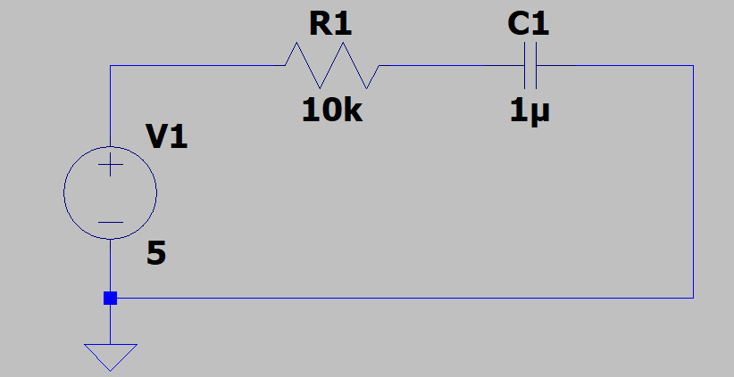

See [file](ltspice/T2_1_RC_op.asc) ↗

**T.2.2 (2 points)** Start a DC operation point (`.op`) simulation with the circuit of **T.2.1** and have a look at the currents and voltages. Do they make sense? Please elaborate and explain. Make sure that the circuit of **T.2.1** contains your updates.
```answer
Yes thie currents and voltages make sense to us. Since we are using a DC source, once the capacitor is fully charger it behaves as an oopen circuit, therefore the currents passing trough the resistor and capacitor should be 0 (or a value close to zero). Thanks to Ohm's law V = RI we can say that there is no loss in voltage at the different nodes of the circuits, therefore is correct to measure 5V everywhere.
```

**T.2.3 (6 points)** Start a transient simulation (`.tran`) and measure the voltage and the current at the capacitor.
- **(2 points)** Submit the circuit `T2_3_RC_tran.asc`, and the screenshot `T2_3_RC_tran.png` of the plot with the measured voltage and current.

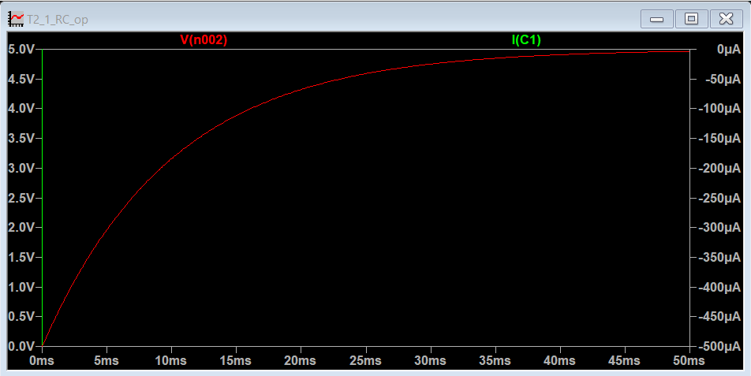

- **(2 points)** Compare the calculated τ = RC and the measured time constant VC(τ) = Vmax(1 − e^−1) ≈ 63.2% Vmax. Specify both time constants. Do they match? Explain your observation.

```answer
τ = RC = 10kOhm * 1uF = 0.01s = 10 ms
on the plot we obtain the value of 3.16V, corresponding to 63.2% of 5V, at 10.0ms, wich correspond to the teoretical calculated value, giving a complete match. This is because the simulation follows exactly the exponential charging law. 
```
- **(2 points)** Plot the power consumption of the circuit over time (P= UI) in LTSpice. Submit the screenshot `T2_3_RC_P.png` of the plot.

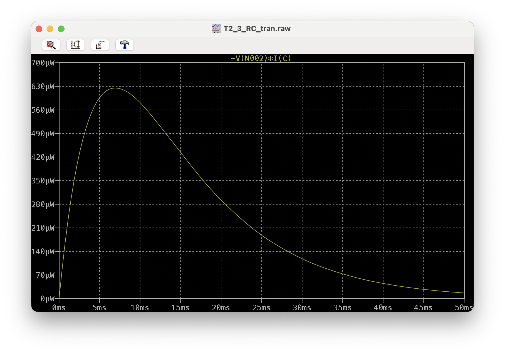


## 3 Filter Circuits - Optional Bonus (20 points)
**T.3.1 (2 points)** Copy the circuit of **T.2.1**. Conduct a small signal AC behavior analysis (`.ac`) with an amplitude of 1 V from 0.01 Hz to 100 Hz. Submit the circuit `T3_1_RC_ac.asc` and the screenshot `T3_1_RC_ac.png` of the phase and amplitude plot.
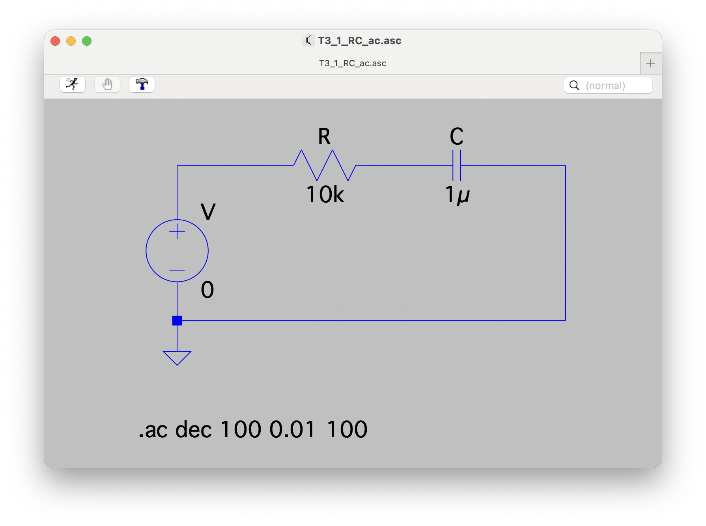

See [file](ltspice/T3_1_RC_ac.asc) ↗

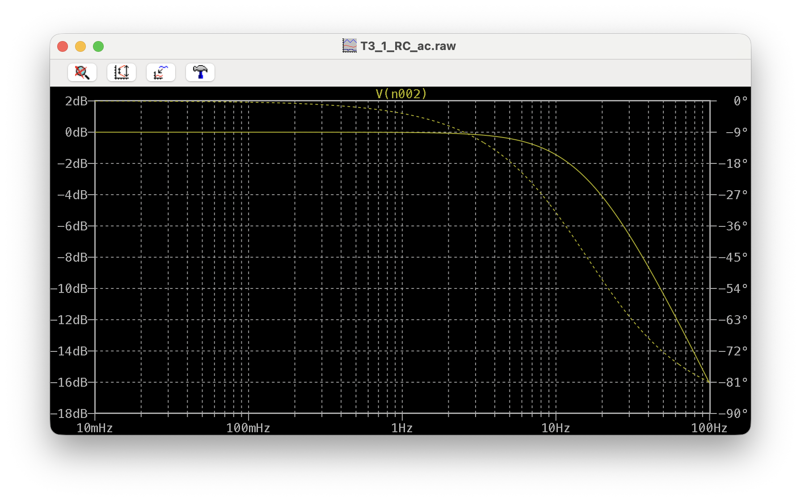

### 3.1 Report (18 points)
**R.3.1 (4 points)** Derive the complex transfer function `H(jω) = Vout / Vin` of the filter. Use symbolic expressions and explain each sub-step. You will get points for the symbolic calculations. You will only get one point for the correct result.
```answer
Type here the answer...
```

**R.3.2 (4 points)** Derive the gain G(ω) = |H(jω)| of the filter. Use symbolic expressions and explaineach sub-step. You will get points for the symbolic calculations. You will only get one point for the correct result.
```answer
Type here the answer...
```

**R.3.3 (4 points)** Derive the phase shift φ(ω) = arg(x+jy) = arctan2(y,x) ≈ arctan(y/x) of the filter. Use symbolic expressions and explain each sub-step. You will get points for the symbolic calculations. You will only get one point for the correct result.
```answer
Type here the answer...
```

**R.3.4 (4 points)** Derive the −3 dB cutoff frequency fc = ωc/(2π) where the gain of the filter equals G(ω) = 1/√(2). Use symbolic expressions and explain each sub-step. You will get points for the symbolic calculations. You will only get one point for the correct result
```answer
Type here the answer...
```

**R.3.5 (2 points)** Compare your results with the result of your LTSpice simulation in **T.3.1**. Elaborate and explain your observations.
```answer
Type here the answer...
```

## 4 Operational Amplifier (Op-Amp) Circuits (18 points)
### 4.1 Voltage Divider with a Resistive Output Load (6 points)

**T.4.1 (1 point)** Create a voltage divider circuit with a 5 V voltage source in LTSpice. Set both resistor values of the voltage divider to 200 kΩ and connect a 500 kΩ load resistance on the divider’s output. Submit the circuit `T4_1_VD.asc`.

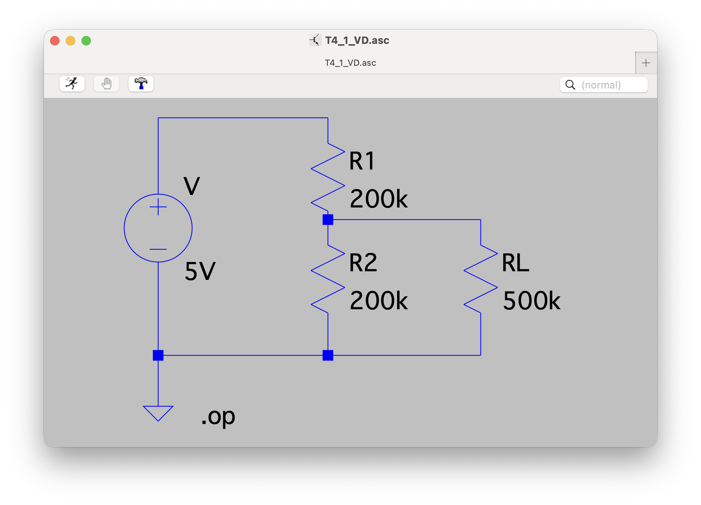

See [file](ltspice/T4_1_VD.asc) ↗

**T.4.2 (1 point)** Increase the crosscurrent of the divider by lowering the divider’s resistor values. How does the load resistance influence the output voltage? Explain your observations and submit the circuit `T4_2_VD.asc`.
```answer
By lowering the divider resistors from 200kΩ to 20kΩ, the output voltage increased from 2.08V to 2.45V. Since the load is connected in parallel to the bottom resistor, with 200kΩ the load resistor significantly alters the total resistance of the bottom half because they are similar in magnitude.By lowering the divider resistors to 20kΩ the cross current of the divider increases, thus the 500kΩ resistor has a much smaller relative impact on the parallel resistance calculation.
```
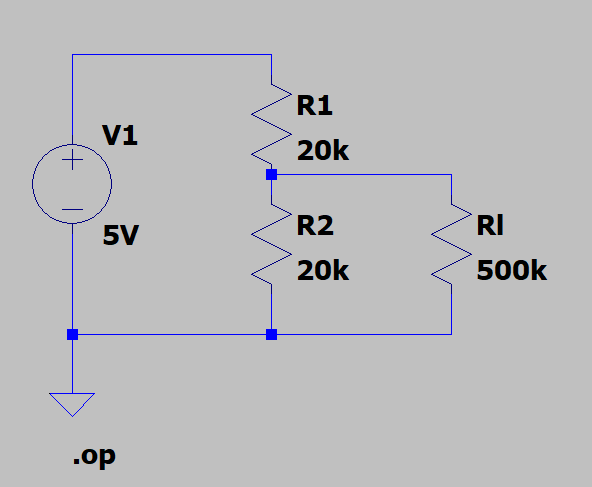

See [file](ltspice/T4_2_VD.asc) ↗

**T.4.3 (2 points)** How does the output voltage error (in %) changes for higher divider currents? Provide two examples and describe the tendency of the error. Explain your observations.
```answer
To measure the error we used the formula Error % = |2.5 - V_measured| / 2.5 * 100.

- With the 200kkΩ resistor we measured an output voltage of 2.08, leadig to an error of 16.8%
- With the 20kΩ resistor we measured an output voltage of 2.45, leading to an error of 2.0%

The tendency of the error is to decrease.
```

**T.4.4 (2 points)** What is the major drawback of high divider currents?
```answer
The major drawback of high divider currents is an high power consumption. This is due to the fact that the power is inversely proportional to the resistance of the circuit (P = V^2/R), and therefore lowering the overall resistance will lead to an higher power consumpion.
```

### 4.2 Voltage Divider with a Resistive Output Load and a Voltage Follower (8 points)

**T.4.5 (2 points)** Copy the circuit of **T.4.1** and add an op-amp based voltage follower circuit between the voltage divider and the resistive load. Include the `opamp` component library using the spice directive `.lib opamp.sub.` Both, the op-amp symbol and the component library are provided by LTSpice. Submit the circuit `T4_5_opamp.asc`.

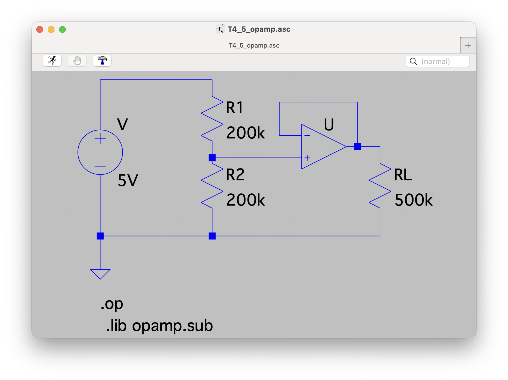

See [file](ltspice/T4_5_opamp.asc) ↗

**T.4.6 (2 points)** How does the output voltage changes in comparison to the setup of **T.4.1** without the voltage follower? Explain your observations.
```answer
The output voltage is now about 2.50V, which is close to the ideal value, compared to the lower value obtained previously.
This is because the voltage follower decouples the load from the divider, thanks to its very high input impedance and the low output impedance. Thanks to this component the load no longer affects the divider ratio.
```

**T.4.7 (4 points)** How much can the crosscurrent of the voltage divider be reduced without affecting the desired output voltage? Explain the limits and your observations.
```answer
In theory, the cross current can be reduced arbitrarily because the op-amp has infinite input impedance. In the real world the inpunt impedance is very high, but finite, therefore the divider resistance can't be too large. If the impedance of the voltage divider is close in magnitude to the one of the op-amp, the current going trough the latter will not be negligeble and the output voltage starts to deviate.
```

### 4.3 Report (4 points)
**R.4.1 (4 points)** What are the advantages and disadvantages of very small crosscurrents in voltage dividers? Explain the advantages/disadvantages you have named.
```answer
Advantage: very low power consumption, because the current through the resistors is small, so less power is dissipated (P = V^2 / R).
Disadvantages:
- higher sensitivity to noise and interference, since small currents are more easily disturbed;
- slower response due to larger RC time constants (τ = R·C -> τ is proportional to R)
- higher output impedance, so the output voltage is more affected by the load
```

## 5 Wheatstone Bridge with a Strain Gauge
### 5.1 Wheatstone Bridge (10 points)
**T.5.1 (2 points)** Create a new LTSpice circuit and design a Wheatstone bridge with 320Ω resistors and a 5V voltage source. Make sure the custom model files `strain-gauge.LIB` and `strain-gauge.asy` for the strain gauge are placed next to your circuit file `T5_1_sg.asc`. Replace the upper left resistor of the Wheatstone bridge with the custom strain gauge component which models the strain gauge. Setup the strain gauge model for the strain gauge symbol and add the spice directive `.lib strain-gauge.LIB` to the circuit.

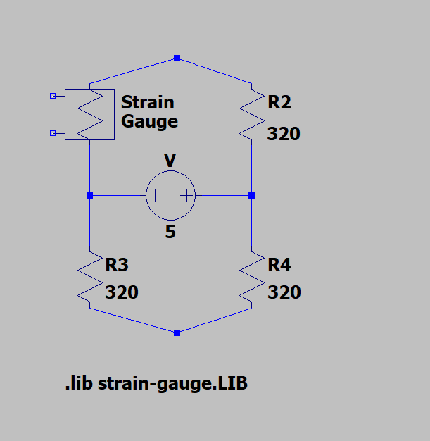

See [file](ltspice/T5_1_sg.asc) ↗

**T.5.2 (2 points)** Set the strain gauge properties of the model to:
- Initial resistance R = 320 Ω
- Strain gauge length L = 0.32 m
- Gauge factor k = 1.76
- Number of sensitive tracks n = 32
Make sure that the circuit file `T5_1_sg.asc` contains your changes.

**T.5.3 (2 points)** To simulate a change of length, connect a sine voltage source to the strain gauge with 1 µV amplitude and 5 Hz. Here, a length change of 1 µm corresponds to a voltage change of 1 µV. Perform a transient simulation for 1 s and a maximum time step of 10 µs and plot the bridge voltage VB. Make sure that the circuit file `T5_1_sg.asc` contains your changes. Submit the plot with the screenshot `T5_3_sg.png`.

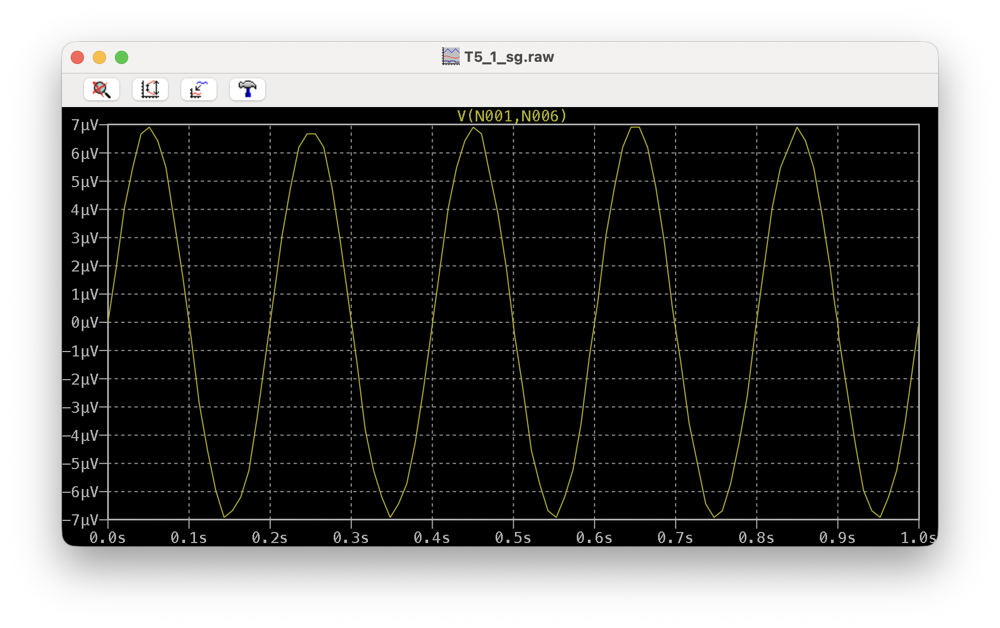


**T.5.4 (2 points)** Lower the maximum simulation time step to 1 µs and compare it with a maximum time step of 20 µs. What differences do you observe? Please explain you observations and submit the screenshots `T5_4_sg_1us.png` and `T5_4_sg_20us.png` of your plots. Submit your circuit file `T5_4_sg.asc` with the maximum time step configured to 10 µs.

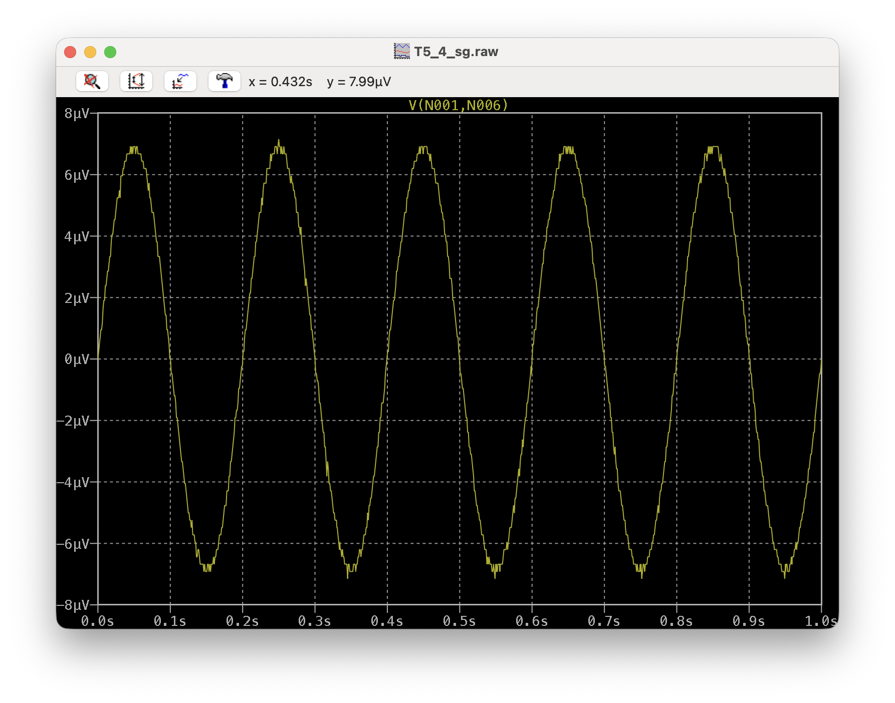

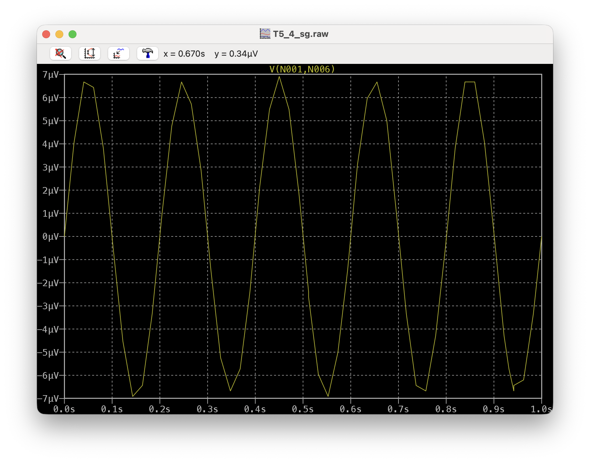

```answer
Type here the answer...
```


See [file](ltspice/T5_4_sg.asc) ↗


**T.5.5 (2 points)** Discuss the simulation results. What do you conclude with respect to the circuit’s applicability? Could you measure the distance changes with the ADC of the AVR microcontroller?

```answer
Type here the answer...
```

### 5.2 Wheatstone Bridge with an Op-Amp (10 points)
**T.5.6 (6 points)** Copy the circuit `T5_4_sg.asc` and rename it to `T5_6_sg_opamp.asc`. Make sure the custom model files `INA122.LIB` and `INA122.asy` for the INA122 instrumental amplifier are placed next to your circuit file. Integrate the INA122 to your circuit such that the INA122
- **(2 points)** operates with a bias voltage of 2.5 V,
- **(2 points)** operates with a gain of 7500, and
- **(2 points)** is correctly connected to the Wheatstone bridge

Submit your circuit file `T5_6_sg_opamp.asc`.

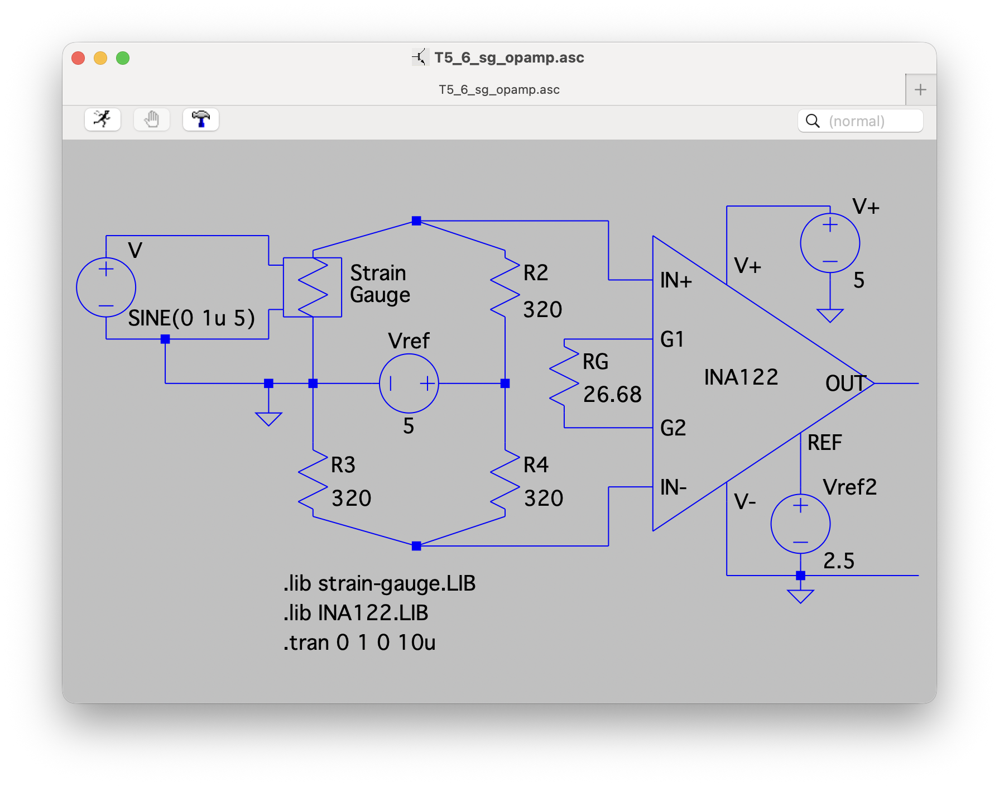

See [file](ltspice/T5_6_sg_opamp.asc) ↗

**T.5.7 (4 points)** Conduct a transient simulation `.tran 0 1 0 10u`, once for the INA122 operating with a bias voltage of 2.5 V, and once for the INA122 operating with a bias voltage of 0 V. What difference do you observe? Explain your observation and submit the screenshots `T5_7_sg_opamp_2500mV.png` and `T5_7_sg_opamp_0000mV.png` of your plots.

```answer
Type here the answer...
```

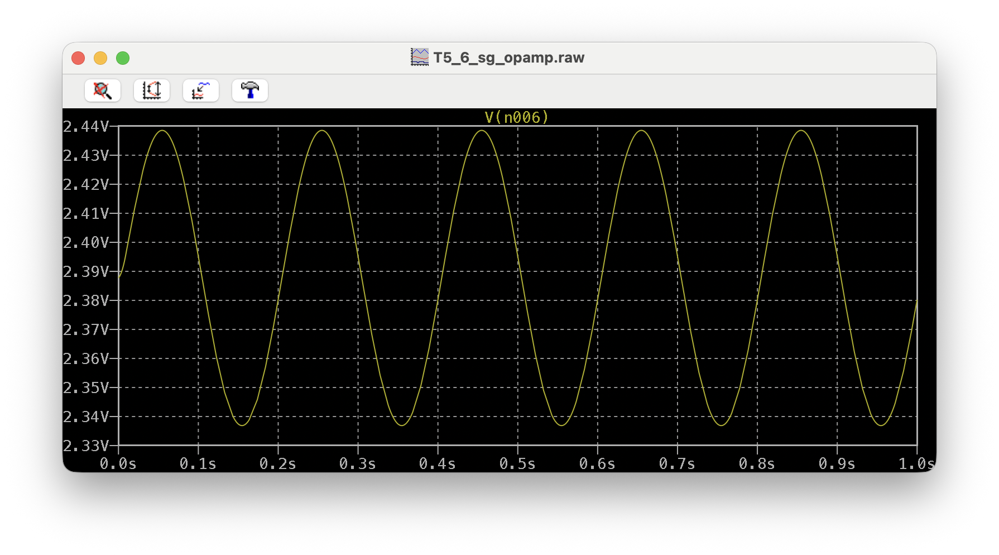

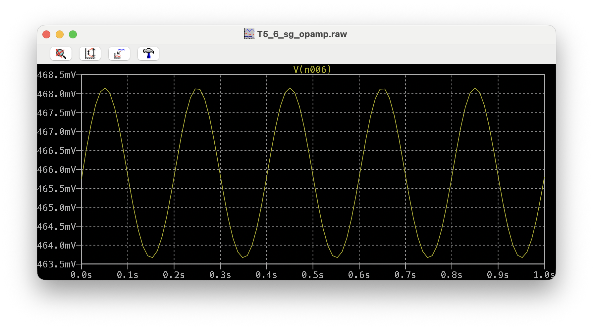

### 5.3 Power Line Noise (6 points)
**T.5.8 (2 points)** Copy the circuit `T5_6_sg_opamp.asc` and rename it to `T5_8_pln.asc`. To simulate power line noise and high frequency noise from actuators, add the following voltage sources in series on top of the 5 V DC voltage source:
- A sine voltage source, 200 mV amplitude, 50 Hz
- A sine voltage source, 200 mV amplitude, 100 Hz
- A sine voltage source, 200 mV amplitude, 1 kHz
Submit your circuit file `T5_8_pln.asc`.

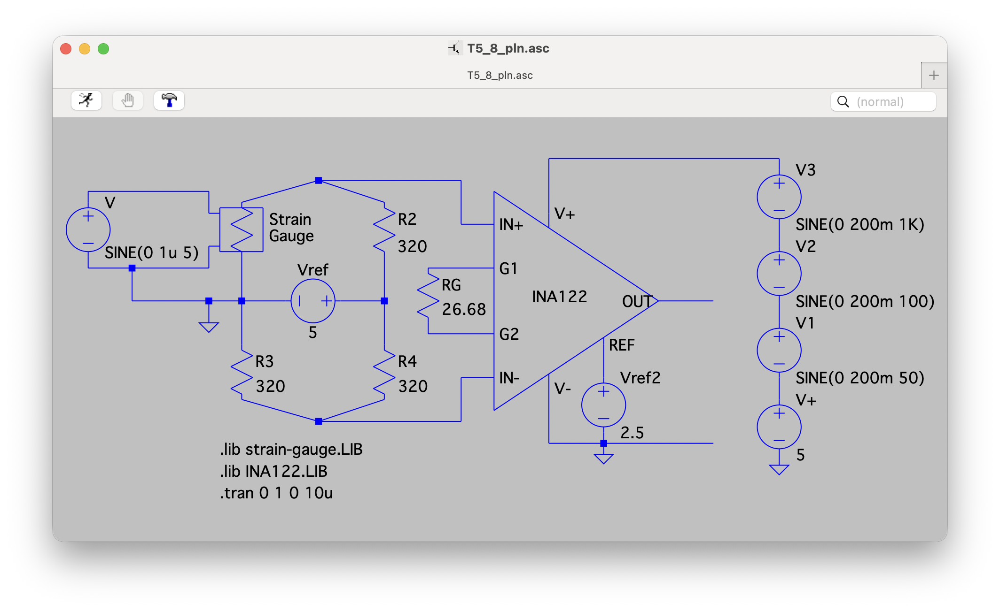

See [file](ltspice/T5_8_pln.asc) ↗

**T.5.9 (2 points)** Which noise sources of **T.5.8** simulate power line noise and which one actuator noise? Please explain your choices.

```answer
Type here the answer...
```

**T.5.10 (2 points)** How do these noise sources influence the output of the op-amp? Explain your observations and submit the screenshot `T5_10_pln.png` of your plot.

```answer
Type here the answer...
```

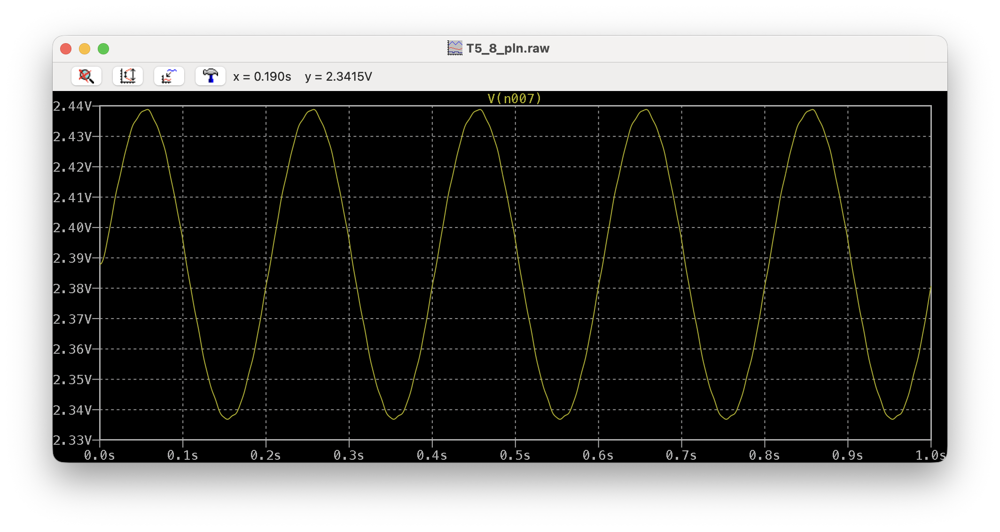


### 5.4 Power Line Noise Filtering (6 points)
**T.5.11 (4 points)** Copy the circuit `T5_8_pln.asc` and rename it to `T5_11_pln_filtered.asc`. Add an LC low pass filter between the voltage sources and the circuit. Use a 10 µH inductor with an ESR of 10 Ω and a 1000 µF capacitor with an ESR of 20 mΩ. Submit your circuit file `T5_11_pln_filtered.asc`.

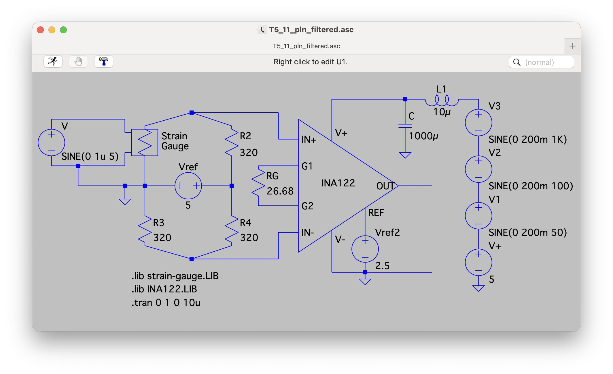

See [file](ltspice/T5_11_pln_filtered.asc) ↗

**T.5.12 (2 points)** How does the filter influence the output of the op-amp? Explain your observations and submit the screenshot `T5_12_pln_filtered.png` of your plot.

```answer
Type here the answer...
```

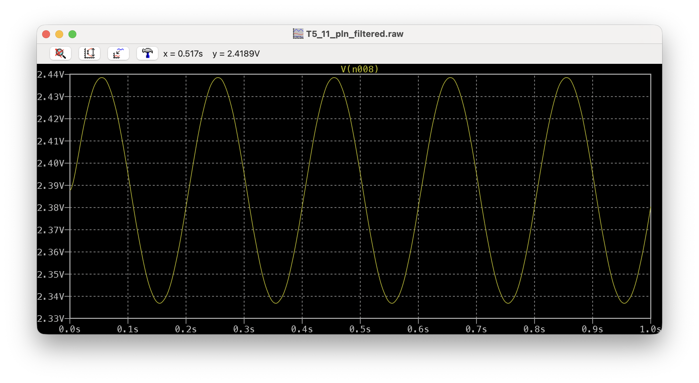
