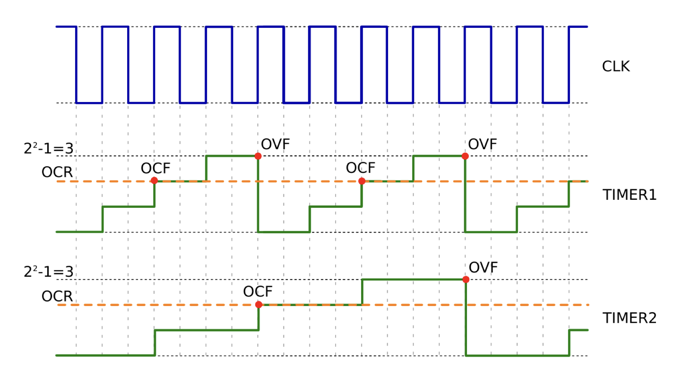
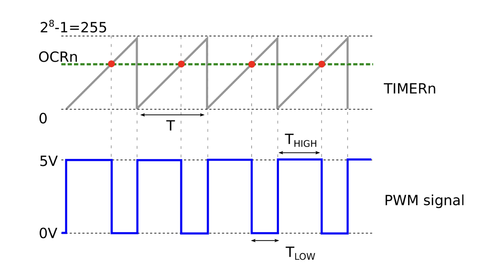

# Humanoid Sensors and Actuators
## Group 5
| Name | Matr. # | Email |
|------|---------|-------|
| Samuele Ribaudo | 03821248 | samuele.ribaudo@tum.de |
| Hong Yan Jun  | 03813507 | go75kes@mytum.de |
| Alessandro Canalicchio | 03796273 | go73xix@mytum.de |
| Niklas Peter | 03812287 | n.peter@tum.de |
| Emile Gebrael | 03812968 | emile.gebrael@tum.de |

# Tutorial 2 - Part 1


Course Instructors: Dr. Florian Bergner
hsa-lecture.ics@xcit.tum.de

Summer Semester 2026

## Initial Setup (Before the Tutorial!)

### Clone the tutorial project
Clone the project and follow the instructions in the `readme.md` file:
```bash
git clone "https://gitlab.lrz.de/hsa/students/hsa_t2s1_ws.git"
```

The best is to setup the Dev Container with LTSpice, but you can also directly install LTSpice in Windows or MacOS.
You can find a short crash course on LTSpice in http://denethor.wlu.ca/ltspice/.

## Electronic Basics (80 points)
After the introduction of microcontrollers, and acquiring the skills to program them for different applications, we now have a look at basic electronic circuits that find their applications in sensing and actuation.

In this tutorial we will learn:
- How to simulate circuits with LTSpice
- How to simulate and calculate filter circuits
- How to simulate operational amplifier (op-amp) circuits

## 2 Getting started with LTSpice (10 points)
In this tutorial we will start simulating electronic circuits with LTSpice. LTSpice bases on the open source circuit simulator SPICE (Simulation Program with Integrated Circuit Emphasis). SPICE was developed at the Electronics Research Laboratory of the University of California, Berkeley and is nowadays still used in integrated circuit and board-level design to check circuit design and predict circuit behavior. LTSpice provides you with a GUI to minimize your effort of writing SPICE programs. Nevertheless, LTSpice still supports all the features of SPICE programs and LTSpice simulations can be combined with manually written SPICE programs.

Familiarize yourself with the basic editing, simulation and evaluation capabilities of LTSpice in these first tasks:

**T.2.1 (2 points)** Create a new schematic in LTSpice and store it in `hsa_t2s1_ws/src`. Add a 5 V voltage source and serially connect it to a 10 kΩ resistor and a 1 µF capacitor. Hand in the circuit `T2_1_RC_op.asc`.


See [file](ltspice/T2_1_RC_op.asc) ↗

**T.2.2 (2 points)** Start a DC operation point (`.op`) simulation with the circuit of **T.2.1** and have a look at the currents and voltages. Do they make sense? Please elaborate and explain. Make sure that the circuit of **T.2.1** contains your updates.
```answer
Yes thie currents and voltages make sense to us. Since we are using a DC source, once the capacitor is fully charger it behaves as an oopen circuit, therefore the currents passing trough the resistor and capacitor should be 0 (or a value close to zero). Thanks to Ohm's law V = RI we can say that there is no loss in voltage at the different nodes of the circuits, therefore is correct to measure 5V everywhere.
```

**T.2.3 (6 points)** Start a transient simulation (`.tran`) and measure the voltage and the current at the capacitor.
- **(2 points)** Submit the circuit `T2_3_RC_tran.asc`, and the screenshot `T2_3_RC_tran.png` of the plot with the measured voltage and current.


- **(2 points)** Compare the calculated τ = RC and the measured time constant VC(τ) = Vmax(1 − e^−1) ≈ 63.2% Vmax. Specify both time constants. Do they match? Explain your observation.

```answer
τ = RC = 10kOhm * 1uF = 0.01s = 10 ms
on the plot we obtain the value of 3.16V, corresponding to 63.2% of 5V, at 10.0ms, wich correspond to the teoretical calculated value, giving a complete match. This is because the simulation follows exactly the exponential charging law. 
```
- **(2 points)** Plot the power consumption of the circuit over time (P= UI) in LTSpice. Submit the screenshot `T2_3_RC_P.png` of the plot.


## 3 Filter Circuits - Optional Bonus (20 points)
**T.3.1 (2 points)** Copy the circuit of **T.2.1**. Conduct a small signal AC behavior analysis (`.ac`) with an amplitude of 1 V from 0.01 Hz to 100 Hz. Submit the circuit `T3_1_RC_ac.asc` and the screenshot `T3_1_RC_ac.png` of the phase and amplitude plot.


See [file](ltspice/T3_1_RC_ac.asc) ↗


### 3.1 Report (18 points)
**R.3.1 (4 points)** Derive the complex transfer function `H(jω) = Vout / Vin` of the filter. Use symbolic expressions and explain each sub-step. You will get points for the symbolic calculations. You will only get one point for the correct result.
```answer
Type here the answer...
```

**R.3.2 (4 points)** Derive the gain G(ω) = |H(jω)| of the filter. Use symbolic expressions and explaineach sub-step. You will get points for the symbolic calculations. You will only get one point for the correct result.
```answer
Type here the answer...
```

**R.3.3 (4 points)** Derive the phase shift φ(ω) = arg(x+jy) = arctan2(y,x) ≈ arctan(y/x) of the filter. Use symbolic expressions and explain each sub-step. You will get points for the symbolic calculations. You will only get one point for the correct result.
```answer
Type here the answer...
```

**R.3.4 (4 points)** Derive the −3 dB cutoff frequency fc = ωc/(2π) where the gain of the filter equals G(ω) = 1/√(2). Use symbolic expressions and explain each sub-step. You will get points for the symbolic calculations. You will only get one point for the correct result
```answer
Type here the answer...
```

**R.3.5 (2 points)** Compare your results with the result of your LTSpice simulation in **T.3.1**. Elaborate and explain your observations.
```answer
Type here the answer...
```

## 4 Operational Amplifier (Op-Amp) Circuits (18 points)
### 4.1 Voltage Divider with a Resistive Output Load (6 points)

**T.4.1 (1 point)** Create a voltage divider circuit with a 5 V voltage source in LTSpice. Set both resistor values of the voltage divider to 200 kΩ and connect a 500 kΩ load resistance on the divider’s output. Submit the circuit `T4_1_VD.asc`.


See [file](ltspice/T4_1_VD.asc) ↗

**T.4.2 (1 point)** Increase the crosscurrent of the divider by lowering the divider’s resistor values. How does the load resistance influence the output voltage? Explain your observations and submit the circuit `T4_2_VD.asc`.
```answer
By lowering the divider resistors from 200kΩ to 20kΩ, the output voltage increased from 2.08V to 2.45V. Since the load is connected in parallel to the bottom resistor, with 200kΩ the load resistor significantly alters the total resistance of the bottom half because they are similar in magnitude.By lowering the divider resistors to 20kΩ the cross current of the divider increases, thus the 500kΩ resistor has a much smaller relative impact on the parallel resistance calculation.
```


See [file](ltspice/T4_2_VD.asc) ↗

**T.4.3 (2 points)** How does the output voltage error (in %) changes for higher divider currents? Provide two examples and describe the tendency of the error. Explain your observations.
```answer
To measure the error we used the formula Error % = |2.5 - V_measured| / 2.5 * 100.

- With the 200kkΩ resistor we measured an output voltage of 2.08, leadig to an error of 16.8%
- With the 20kΩ resistor we measured an output voltage of 2.45, leading to an error of 2.0%

The tendency of the error is to decrease.
```

**T.4.4 (2 points)** What is the major drawback of high divider currents?
```answer
The major drawback of high divider currents is an high power consumption. This is due to the fact that the power is inversely proportional to the resistance of the circuit (P = V^2/R), and therefore lowering the overall resistance will lead to an higher power consumpion.
```

### 4.2 Voltage Divider with a Resistive Output Load and a Voltage Follower (8 points)

**T.4.5 (2 points)** Copy the circuit of **T.4.1** and add an op-amp based voltage follower circuit between the voltage divider and the resistive load. Include the `opamp` component library using the spice directive `.lib opamp.sub`. Both, the op-amp symbol and the component library are provided by LTSpice. Submit the circuit `T4_5_opamp.asc`.


See [file](ltspice/T4_5_opamp.asc) ↗

**T.4.6 (2 points)** How does the output voltage changes in comparison to the setup of **T.4.1** without the voltage follower? Explain your observations.
```answer
The output voltage is now about 2.50V, which is close to the ideal value, compared to the lower value obtained previously.
This is because the voltage follower decouples the load from the divider, thanks to its very high input impedance and the low output impedance. Thanks to this component the load no longer affects the divider ratio.
```

**T.4.7 (4 points)** How much can the crosscurrent of the voltage divider be reduced without affecting the desired output voltage? Explain the limits and your observations.
```answer
In theory, the cross current can be reduced arbitrarily because the op-amp has infinite input impedance. In the real world the inpunt impedance is very high, but finite, therefore the divider resistance can't be too large. If the impedance of the voltage divider is close in magnitude to the one of the op-amp, the current going trough the latter will not be negligeble and the output voltage starts to deviate.
```

### 4.3 Report (4 points)
**R.4.1 (4 points)** What are the advantages and disadvantages of very small crosscurrents in voltage dividers? Explain the advantages/disadvantages you have named.
```answer
Advantage: very low power consumption, because the current through the resistors is small, so less power is dissipated (P = V^2 / R).
Disadvantages:
- higher sensitivity to noise and interference, since small currents are more easily disturbed;
- slower response due to larger RC time constants (τ = R·C -> τ is proportional to R)
- higher output impedance, so the output voltage is more affected by the load
```

## 5 Wheatstone Bridge with a Strain Gauge
### 5.1 Wheatstone Bridge (10 points)
**T.5.1 (2 points)** Create a new LTSpice circuit and design a Wheatstone bridge with 320Ω resistors and a 5V voltage source. Make sure the custom model files `strain-gauge.LIB` and `strain-gauge.asy` for the strain gauge are placed next to your circuit file `T5_1_sg.asc`. Replace the upper left resistor of the Wheatstone bridge with the custom strain gauge component which models the strain gauge. Setup the strain gauge model for the strain gauge symbol and add the spice directive `.lib strain-gauge.LIB` to the circuit.


See [file](ltspice/T5_1_sg.asc) ↗

**T.5.2 (2 points)** Set the strain gauge properties of the model to:
- Initial resistance R = 320 Ω
- Strain gauge length L = 0.32 m
- Gauge factor k = 1.76
- Number of sensitive tracks n = 32
  
Make sure that the circuit file `T5_1_sg.asc` contains your changes.

**T.5.3 (2 points)** To simulate a change of length, connect a sine voltage source to the strain gauge with 1 µV amplitude and 5 Hz. Here, a length change of 1 µm corresponds to a voltage change of 1 µV. Perform a transient simulation for 1 s and a maximum time step of 10 µs and plot the bridge voltage VB. Make sure that the circuit file `T5_1_sg.asc` contains your changes. Submit the plot with the screenshot `T5_3_sg.png`.


**T.5.4 (2 points)** Lower the maximum simulation time step to 1 µs and compare it with a maximum time step of 20 µs. What differences do you observe? Please explain you observations and submit the screenshots `T5_4_sg_1us.png` and `T5_4_sg_20us.png` of your plots. Submit your circuit file `T5_4_sg.asc` with the maximum time step configured to 10 µs.

 

```answer
The graph on the left (1us) took longer to generate, but it has clearly an higher resolution. On the second one you can see the straight lines connecting the fewer calculation points, while on the first one the singal appears to be a well defined sinusoid.
The maximum timestep determines how often LTSpice calculates the circuit's state. With a 20 us step, the simulator takes fewer samples, leading to a loss of detail and a faster simulation.
```

See [file T5_4_sg.asc](ltspice/T5_4_sg.asc) ↗


**T.5.5 (2 points)** Discuss the simulation results. What do you conclude with respect to the circuit’s applicability? Could you measure the distance changes with the ADC of the AVR microcontroller?

```answer
No we can't measure the distance changes with the ADC of the AVR microcontroller.
The ATmega32 features a 10 bit ADC. With the 5V reference, the smallest detectable voltage change is the resolution of one bit and it is equal to 5V/(2^(10)) = 4.88 mV.
The transient simulation shows that a length change of 1 um results in a differential bridge voltage VB with an amplitude of approximately 7 uV, wich is roughly 700 times smaller than the risolution of ATmega32's ADC.
```

### 5.2 Wheatstone Bridge with an Op-Amp (10 points)
**T.5.6 (6 points)** Copy the circuit `T5_4_sg.asc` and rename it to `T5_6_sg_opamp.asc`. Make sure the custom model files `INA122.LIB` and `INA122.asy` for the INA122 instrumental amplifier are placed next to your circuit file. Integrate the INA122 to your circuit such that the INA122
- **(2 points)** operates with a bias voltage of 2.5 V,
- **(2 points)** operates with a gain of 7500, and
- **(2 points)** is correctly connected to the Wheatstone bridge

Submit your circuit file `T5_6_sg_opamp.asc`.

See [INA122 datasheet](https://www.ti.com/lit/ds/symlink/ina122.pdf?ts=1777506066739&ref_url=https%253A%252F%252Fwww.mouser.com%252F) ↗
```answer
Based on INA122 datasheet (linked above) to obtain a gain G of 7500 we have to put a resitor RG = 200kOhm/(G - 5) = 26.68 Ohm
```


See [file](ltspice/T5_6_sg_opamp.asc) ↗

**T.5.7 (4 points)** Conduct a transient simulation `.tran 0 1 0 10u`, once for the INA122 operating with a bias voltage of 2.5 V, and once for the INA122 operating with a bias voltage of 0 V. What difference do you observe? Explain your observation and submit the screenshots `T5_7_sg_opamp_2500mV.png` and `T5_7_sg_opamp_0000mV.png` of your plots.

```answer
For the INA122 operating with a bias voltage of 2.5 V we observe the expected behavior: we obtain a sinusoid with an amplitude of (2.440 - 2.335)/2  = 0.0525 V = 52.5 mV, which is equal to the expected amplitude of 7uV * 7500 = 52.5 mV.
For the INA122 operating with a bias voltage of 0 V, we obtain a sinusoid with an amplitude of (468mV - 463.5mV)/2  = 2.25 mV.
```


### 5.3 Power Line Noise (6 points)
**T.5.8 (2 points)** Copy the circuit `T5_6_sg_opamp.asc` and rename it to `T5_8_pln.asc`. To simulate power line noise and high frequency noise from actuators, add the following voltage sources in series on top of the 5 V DC voltage source:
- A sine voltage source, 200 mV amplitude, 50 Hz
- A sine voltage source, 200 mV amplitude, 100 Hz
- A sine voltage source, 200 mV amplitude, 1 kHz
Submit your circuit file `T5_8_pln.asc`.


See [file](ltspice/T5_8_pln.asc) ↗

**T.5.9 (2 points)** Which noise sources of **T.5.8** simulate power line noise and which one actuator noise? Please explain your choices.

```answer
The power line noise may be simulated by the 50 Hz and 100 Hz sources, sicne in Europe AC power grids operate at 50 Hz.
The actuator noise may be simulated by the 1 kHz source, since actuators often use pulse width modulation, which generates interferences at much higher frequencies than the power grid.

```

**T.5.10 (2 points)** How do these noise sources influence the output of the op-amp? Explain your observations and submit the screenshot `T5_10_pln.png` of your plot.

```answer
The noise sources have a minimal visual influence on the output signal. The reason the output isn't ruined too much by the noise is the Power Supply Rejection Ratio PSRR (page 6 of the INA122 datasheet). The datasheet specifies a PSRR of 10 μV/V. This means for every 1 V of noise on the power supply, only 10 uV reaches the input stage.
```


### 5.4 Power Line Noise Filtering (6 points)
**T.5.11 (4 points)** Copy the circuit `T5_8_pln.asc` and rename it to `T5_11_pln_filtered.asc`. Add an LC low pass filter between the voltage sources and the circuit. Use a 10 µH inductor with an ESR of 10 Ω and a 1000 µF capacitor with an ESR of 20 mΩ. Submit your circuit file `T5_11_pln_filtered.asc`.


See [file](ltspice/T5_11_pln_filtered.asc) ↗

**T.5.12 (2 points)** How does the filter influence the output of the op-amp? Explain your observations and submit the screenshot `T5_12_pln_filtered.png` of your plot.

```answer
The LC filter makes the output of the op-amp clean, like the result obtained in T.5.6. This is because the filter cut off the disturbancies, leaving only the steady power supply.
```


# Tutorial 2 - Part 2

## Microcontrollers: ADC, PWM, and Servo Motors (132 points)

In the second part of tutorial 2 we will have a look at the analog-digital comparator (ADC) peripheral block of the microcontroller. The ADC allows us to sample analog signals, thus to embed the microcontroller in analog circuits. We will also look into Timer/Counters, PWM generation, and servo motors.

In this tutorial we will learn:
- How to use the ADC peripheral block
- How to sample analog signals and send them to the computer
- How to measure the capacitance in a RC serial circuit
- How to use the Timer/Counters to generate interrupts
- How to generate Pulse Width Modulation (PWM) signals

## Initial Setup (Before the Tutorial!)

### Pull the updated Docker image

You need to pull the updated Docker image. The docker image you pulled in tutorial session 1 part 2 is outdated.

```bash
# Pull image
docker login "gitlab.lrz.de:5005"
docker pull "gitlab.lrz.de:5005/hsa/students/docker/avr/avr:focal-vscode"
docker tag "gitlab.lrz.de:5005/hsa/students/docker/avr/avr:focal-vscode avr:focal-vscode"
```

### Clone the tutorial project

```bash
git clone "https://gitlab.lrz.de/hsa/students/hsa_t2s2_ws.git"
```

### Open the tutorial project in the Dev Container

1. Remove any previously started Dev Containers of the project.
```bash
docker rm hsa_t2s2_ws_devcont
```

2. Open the tutorial project in VS Code:
```bash
cd hsa_t2s2_ws
code.
```

3. Press `Ctrl+Shift+`P, type `Dev Containers: Rebuild and Reopen In Container`, and press `Enter`. The project is now opened in the Dev Container and all terminals in VS Code will be running in the container environment.

4. After you built the Dev Container you can also open it later again with `Dev Containers: Reopen In Container` and skip the container building process.

## 6 Using the ADC Peripheral Block (49 points)

### 6.1 Testing the ADC peripheral block (3 points)

Program your microcontroller with the file `adc_uart.hex`:

Connect the FTDI device to the UART port of the microcontroller. Check the schematic provided in tutorial 1 part 1.

Then launch the Python script that connects to the FTDI device and observe the printout:
```bash
cd hsa_t2s2_ws
cd src/adc_poti
# run the python script, you can exit it by pressing 'q' and then 'Enter'
# use 's' and then press 'Enter' to start the logging and print out
# use 'e' and then press 'Enter' to stop the logging and print out
./log.py
```

**T.6.1 (1 point)** How does a potentiometer work? What are the pinouts and how should it be connected?
1. Connect a $100k\Omega$ potentiometer. Connect one of the outer pins to GND and the other to 5V. Connect the middle pin to ADC0 (see µC pinout of T1.1).
```answer
Type here the answer...
```

**T.6.2 (1 point)** Explain what you see in the output when you change the value of the potentiometer? What are the minimum and maximum values?
```answer
Type here the answer...
```

**T.6.2 (1 point)** What is this microcontroller program doing?
```answer
Type here the answer...
```

**T.6.3 (Bonus: 5 points)** Use the `log.py` Python script as a template and write a new script that opens the serial port and plots the reading of the ADC in real-time. Submit the new script `adc_plotter.py`.

```answer
Type here the code...
```
See [full code](code/adc_plotter.py) ↗

### 6.2 Sampling Analog Signals with the ADC (18 points)
Please use the tutorial project `hsa_t2s2_ws` as basis for the tasks introduced in this section. Please submit the code you created as specified in the tasks. You can find template files for each task in the folder `hsa_t2s2_ws/src/adc_poti/src/applications`.

**T.6.4 (8 points)** Consult the data sheet `Atmega32.pdf` (`hsa_t2s2_ws/docs/`) of the AVR Atmega32. Implement your own program in C to sample analog signals with the ADC considering the following instructions to set the proper bits in the registers:
- **(2 points)** The ADC uses the AVCC voltage (5 V) and assume that an external decoupling capacitor is connected to the AREF pin.
- **(2 points)** The ADC uses a prescaler of 2 such that the operating frequency of the ADC is half the CPU frequency, in our case 500 kHz.
- **(2 points)** The ADC operates in the free running mode.
- **(2 points)** The ADC operates in the 8 bit sampling mode, i.e. the correct 8 bits of a 8 bit sample are loaded into one sample register of the ADC.

**T.6.5 (2 points)** Use the AVR UART library introduced in T1.3 as provided in the template file `hsa_t2s2_ws/src/adc_poti/src/applications/main_adc_poti.c` project to communicate with the computer.

**T.6.6 (4 points)** Implement a function to sample and read the 8bit ADC value for a specified channel using the following function declaration:
```c
void adc_readBlocking (uint8_t* b, uint8_t ch);
```
- **(2 points)** The function uses the `ch` argument and samples the correct channel.
- **(2 points)** The function samples and returns the correct 8 bits of the sample.

**T.6.7 (2 points)** Send the samples of pin ADC2 in binary format to the computer.

**T.6.8 (2 points)** Connect the potentiometer to the ADC2 pin, such that you can use the potentiometer to set voltages between 0V and 5V. Use the Python scripts `log.py` and `plot.py` and capture the data while turning the potentiometer. The computer program generates a CSV file `adc_log.csv`. You can plot this file with the Python script `plot.py`.

Please submit the following files containing your solution for tasks T.6.4 to T.6.8:
*   `main_adc_poti.c`
*   `adc_poti.csv` containing the sample of your potentiometer experiment
*   A screenshot `adc_poti.png` of the plot that you created with the `adc_poti.csv`

### 6.3 Measuring the Capacitance of a Capacitor with the ADC (14 points)
Now, we use a simple RC series circuit to measure the capacitance of a capacitor with the ADC. While we want to determine the capacitance, the resistance and the sampling frequency are known.
Please submit the code you created as specified in the tasks. You can find template files for each task in the folder `hsa_t2s2_ws/src/adc_rcsc/src/applications`. The template files of this section use pre-compiled libraries for the UART and the ADC peripheral blocks. Please use these libraries for implementing the tasks of this section. You can implement all tasks of this section without completing the tasks of the previous sections.

**T.6.9 (2 points)** Use the pin PC1 to charge/discharge a $1 \mu F$ capacitor via a $1k\Omega$ resistor.

**T.6.10 (4 points)** Visualize in the oscilloscope the charge/discharge process.

**T.6.11 (4 points)** Use the ADC0 pin to sample the loading curve with maximum ADC sampling frequency. To minimize any delays between samples first store 1024 samples into the SRAM.

**T.6.12 (2 points)** Then send the 1024 samples you stored into the SRAM to the computer using the 
```c
void uart_writeBlocking (const uint8_t* d, uint16_t size);
``` 
function.

**T.6.13 (2 points)** Save the CSV file of the 1024 samples and plot it. Note: You will need this CSV file to answer some questions in your report.

Please submit the following files:
*   `main_adc_rcsc.c`
*   `adc_rcsc.csv`
*   A screenshot `adc_rcsc.png`
*   A picture `rc_scope.png` of your oscilloscope measurement

### 6.4 Report (14 points)
**R.6.1 (4 points)** In T.6.4 you use the ADC with specific settings and a CPU frequency of 1 MHz. How many CPU cycles pass between the acquisitions of two ADC samples? Elaborate and explain.
```answer
Type here the answer...
```

**R.6.2 (2 points)** What is then the sampling frequency of the ADC?
```answer
Type here the answer...
```

**R.6.3 (2 points)** Assuming that each iteration of your for-loop for the 1024 samples (T.6.11) takes $32 \mu s$, what is limiting your actual sampling frequency: 
- The iteration time of the for-loop ($32 \mu s$), or 
- the sampling time of the ADC in free running mode?
```answer
Type here the answer...
```

**R.6.4 (2 points)** Use your results of T.6.13 and measure the $3\tau$ ($\tau=RC$) value. Remember the capacitance is not known and will be determined using the value.
```answer
Type here the answer...
```

**R.6.5 (2 points)** What ADC tick value (range: 0 to 255) did you use for measuring $3\tau$? Please explain your computations in detail.
```answer
Type here the answer...
```

**R.6.6 (2 points)** What voltage level does this ADC value represent? Please explain your computations in detail.
```answer
Type here the answer...
```

**R.6.7 Bonus (2 points)** Use the $\tau$ value you determined in R.6.4 and the given resistance $R=1k\Omega$ and calculate the capacitance C of the capacitor.
```answer
Type here the answer...
```

**R.6.8 Bonus (4 points)** We discussed the operation of the ADC in the lecture. Let's assume that the conversion logic uses a digital counter with a DAC to generate a voltage ramp. Considering the Sample&Hold time and the total conversion time of the ADC (see datasheet, R.6.1) with the settings used in T.6.4, what would be the minimal frequency of the clock that drives the digital counter generating that voltage ramp?
```answer
Type here the answer...
```

## 7 AVR Timers/Counters (25 points)
A timer is a special peripheral register whose value is incremented or decremented automatically by the microcontroller at a user-defined multiple of the clock frequency. A 8-bit timer for example, has values ranging from 0 to (2^8 - 1) = 255 and will therefore reach its maximum value in K x 255 clock ticks, where K is the so called timer clock prescaler. When a timer reaches its maximum value, the next K -multiple clock tick makes it "overflow". This means that its register value is rolled back to 0 and that a new count cycle is automatically initiated. When a timer overflows or reaches a predefined value, an interrupt can be generated to inform the CPU and potentially triggers some actions at a well defined rate. The AVR has 3 different timers: One of 16 bits and two of 8 bits.



Figure 1: Timing Diagrams of two hypothetical 2-bit timers with values ranging from 0 to 3, namely TIMER1 with a clock prescaler K = 1 and TIMER2 with K = 2, alongside with the clock signal CLK of the microcontroller. The overflow flag and output-compare flags are here labeled as OVF and OCF respectively. Note that more detailed versions of this diagram are available on the AVR datasheet at pages 105 and 106.

### Setup
- Please submit the code you created as specified in the tasks. You can find template files for each task in the folder `hsa_t2s2_ws/src/timer/srcapplications`.
- In this first exercise, we want to use the overflow interrupt of TIMER2 (8-bits) in order to blink a LED connected to the pin PC0 of the microcontroller, at exactly 0.5Hz. Please connect your LED with an appropriate resistance to PC0 as in the past tutorials


### 7.1 Code (10 points)
**T.7.1 (5 points)** Within your `main()` function of `main_timer_blink.c`:
*   Start by including the AVR interrupt library within your code template: `#include <avr/interrupt.h>`
*   You should then disable the interrupts. This is in general a good practice, which prevents the microcontroller from being interrupted while performing important operations.
*   In the `TIMER2 Control Register` (TCCR2), initialize the timer clock prescaler to 64.
*   Set TIMER2 to issue an interrupt when an overflow event is detected. To do so, set the
"``Overflow Interrupt Enable`" in the `Timer Interrupt Mask Register` (TIMSK).
*   Initialize the `TIMER2 Counter Register` (TCNT2) to 0. The value of this register will be automatically incremented by one unit at each tic of the prescaled clock, and will roll back to zero at overflow.
*   Set C0 as the desired output pin.
*   You can now re-enable the interrupts by setting the global interrupt enable.
*   Define a dummy infinite loop in order to maintain your microcontroller active.

**T.7.2 (5 points)** Outside the `main()` function:
Write an interrupt service routine (ISR) catching the overflow interrupt vector of TIMER2:
```c
ISR (TIMER2_OVF_vect)
{
    // Use a global volatile variable to change LED state at 0.5 Hz
}
```

Use a global variable4 in the ISR, so that the LED state changes after a defined number of counter overflow, corresponding to a blinking frequency of 0.5 Hz. Give this number into your report and justify.

Please submit the following files:
- `main_timer_blink.c`

### 7.2 Report (15 points)
**R.7.1 (3 points)** Define the following terms using your own words:
1. Interrupt
2. Interrupt service routine
3. Busy wait state
```answer
Type here the answer...
```

**R.7.2 (2 points)** Explain why interrupts are so appealing compared to busy wait states.
```answer
Type here the answer...
```

**R.7.3 (5 points)** What happens when an interrupt flag is raised during the execution of another interrupt routine? Justify by referring to the relevant datasheet page number(s).
```answer
Type here the answer...
```

**R.7.4 Bonus (3 points)** Based on your answer to the previous question, discuss whether an external interrupt request, say `INT0`, can interrupt the ISR of `TIMER2 OVF`.
```answer
Type here the answer...
```

**R.7.5 (5 points)** What happens on the AVR when an ISR takes too long to execute? Is it then possible to interrupt an ISR with the same interrupt flag that triggered it in the first place? Justify.
```answer
Type here the answer...
```

**R.7.6 Bonus (5 points)** Knowing the clock frequency of the microcontroller and the size of the timer register, propose a new timer clock prescaler value, allowing to get as close as possible to the desired blinking frequency with the previously implemented method. Justify.
```answer
Type here the answer...
```

## 8 Pulse Width Modulation (20 points)
Digital devices can only generate two voltage levels: HIGH=5 V and LOW=0 V. Pulse Width Modulation (PWM) is a widely used modulation technique which consists in varying the portion of the time a periodic digital signal spends in state "HIGH" versus the time that this signal spends in state "LOW". In this context, we define the so called Duty cycle of such a signal as:

$D = \frac{T_{HIGH}}{T_{HIGH} + T_{LOW}} \times 100\%$          (1)

PWM signals with different frequencies and duty cycles can be easily generated by exploiting some specific features of timers, namely the prescaler, the overflow interrupt and the compare-match interrupt. When a timer is properly configured (c.f. AVR datasheet), its value is incremented until it matches that of the corresponding Output Compare Register (OCR), previously defined by the user. In general, at this stage, there are two possibilities to generate a PWM on an AVR:

1. Either by playing with the overflow and output-compare ISR (c.f. AVR datasheet, p.71)
2. or by using the Compare-Match-Output Unit in wave-generation mode (c.f. AVR datasheet, p.72)



Figure 2: PWM generation principle on a microcontroller: The PWM signal (in blue) is here obtained with a 8-bit timer (`TIMERn` in gray) and output compare register ``OCRn` (in dashed green).

During this tutorial session, we will explore the first PWM generation mode and play with ISR.

### 8.1 Code (15 points)
**T.8.1 (5 points)** PWM generation with fixed duty cycle, modify `main_timer_pwm.c`:
*   Start by including the AVR interrupt library within your code template: `#include <avr/interrupt.h>`
*   Initialize TIMER0 clock prescaler to 1024.
*   Set TIMER0 to issue an interrupt when an overflow event is detected. To do so, set the "`Overflow Interrupt Enable`" in the `Timer Interrupt Mask Register` (TIMSK).
*   Set TIMER0 to issue an interrupt when a compare-match event is detected. To do so, set the "`Output Compare Interrupt Enable`" in the `Timer Interrupt Mask Register` (TIMSK).
*   Set C0 as the desired output pin
*   Define a dummy infinite loop in order to maintain your microcontroller active.
*   Following the timing diagram of Figure 2, implement a PWM generation routine using the OVF and OCF ISR.


**T.8.2 (10 points)** PWM generation with adjustable duty cycle, modify `main_timer_pwm_adc.c`:

The idea is here to use the 8-bit values read by the ADC of your microcontroller as duty cycle reference for your PWM signal.

Start by setting the ADC with the following settings:
*   Use the ADC in the 8 bit mode.
*   Connect the potentiometer to the ADC0 pin.
*   Use an ADC prescaler of 128 so that the duty cycle of your PWM is not changed too frequently.
*   Do not use the free running mode but rather the interrupt generation mode so that when a conversion is finished, an interrupt is issued by the ADC and processed in a dedicated ISR:
```c
ISR (ADC_vect)
{
}
```
Use this ISR to update a global variable with the read ADC value. You can then use this variable to update the value of the OCR register in the OVF ISR.

Light a LED with the obtained signal. What do you observe when you change the duty cycle? What happens when the value of the duty cycle gets close to a minimum or a maximum?
***Hint:*** Use an oscilloscope to visualize the signal.

Please submit the following files:
*   `main_timer_pwm.c`
*   `main_timer_pwm_adc.c`


### 8.2 Report (5 points)
**R.8.1 (2 points)** Which AVR timers can be used for PWM generation? Why? Justify by refering to the relevant datasheet page numbers.
```answer
Type here the answer...
```

**R.8.2 (3 points)** Propose an explanation to the observations you made in T.8.2 regarding the minimum and maximum values of the duty cycle.
```answer
Type here the answer...
```

**R.8.3 Bonus (2 points)** Explain in your own words what `Double-Buffering` is (you may take a look at the AVR dataseet).
```answer
Type here the answer...
```

## 9 Servo Motors, ADC, and Flex-Sensors (38 points)
Please submit the code you created as specified in the tasks. You can find template files for each task in the folder `hsa_t2s2_ws/src/timer/src/applications`.

**T.9.1 (10 points)** Connect a servo motor to your microcontroller. Connect the servo motor also to +5V and GND. Generate a PWM signal to drive it through its full range. Check the datasheet of a servo motor. Most servo motors use the standard protocol. Visualize the changes of the duty cycle on the oscilloscope. Please submit:

*   A video of the servo motor through its full rotation range `timer_servo.mp4`
*   Oscilloscope pictures of three different angle readings (indicate the period and duty cycle) `timer_servo_1.png`, `timer_servo_2.png`, `timer_servo_3.png`
*   Your code in `main_timer_servo.c`

**T.9.2 (3 points)** Use a multimeter to read the resistance values of a flex sensor when extended and flexed. Describe the behavior between flection/extension and resistance?
```answer
Type here the answer...
```

**T.9.3 (5 points)** Build a resistor divider with the flex sensor and connect it to the pin ADC0[cite: 1]. Calculate values for the resistor divider to measure the full range of the flex sensor[cite: 1]. Explain your calculations and how you chose the resistor[cite: 1].
```answer
Type here the answer...
```

**T.9.4 (10 points)** Read the values of the flex sensor with your ADC and send them over UART. What are the limits? How can you tune the ADC to have the best accuracy and range the microcontroller can offer? Please submit your code in `main_timer_sensor.c`.
```answer
Type here the answer...
```

**T.9.5 (10 points)** Program your microcontroller to move the motor when you flex the sensor. It should go through the whole range of the motor and the flex sensor. Please submit:
*   Your code in `main_timer_servo_sensor.c`
*   A video `main_timer_servo_sensor.mp4`
*   A short explanation how your program works
```answer
Type here the answer...
```