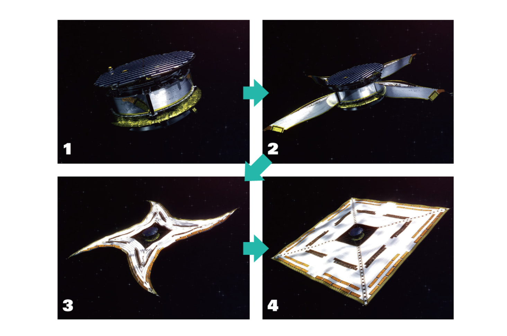
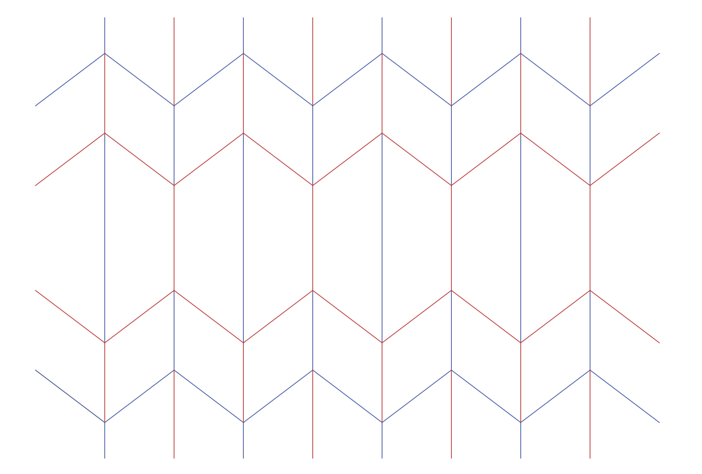
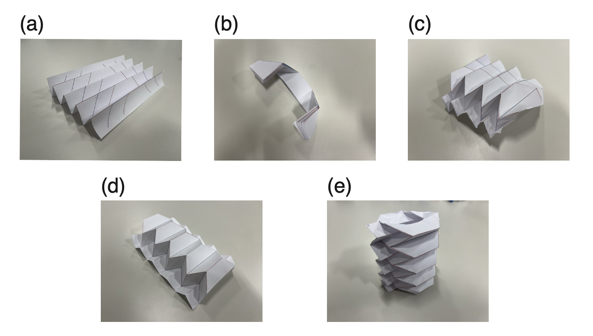

# Humanoid Sensors and Actuators
## Group 5
| Name | Matr. # | Email |
|------|---------|-------|
| Samuele Ribaudo | 03821248 | samuele.ribaudo@tum.de |
| Hong Yan Jun  | 03813507 | go75kes@mytum.de |
| Alessandro Canalicchio | 03796273 | go73xix@mytum.de |
| Niklas Peter | 03812287 | n.peter@tum.de |
| Emile Gebrael | 03812968 | emile.gebrael@tum.de |

We recomend viewing this report [here con GitHub ↗](https://github.com/samuele-ribaudo/humanoid-sensors-and-actuators/tree/main/T3), or with a markdown viewer.

# Tutorial 3 - Part 1


Course Instructors: Dr. Florian Bergner
hsa-lecture.ics@xcit.tum.de

Summer Semester 2026

## 1 Introduction
### 1.1 Introduction to origami and its engineering applications
Origami is the traditional Japanese art of paper folding, and it has inspired a wide range of engineering applications. One of the most well-known examples is the Miura-ori fold, which has been applied to deployable space structures such as solar panels and antennas. These structures can be folded compactly for transportation and then deployed efficiently in space, as shown in Figure 1. In the field of soft actuators, many researchers have explored origami-inspired structures to achieve programmable deformation. One representative example is the Tachi-Miura Polyhedron (TMP) fold. In this tutorial, you will fabricate a simple origami-inspired soft actuator using paper and a plastic bag based on this concept.

### 1.2 Outline of the tutorial
In Tutorials T3.1 and T3.2, you will design, fabricate, and evaluate a simple origami-inspired vacuum actuator using paper and plastic bags. In T3.1, you will focus on the fabrication process, including folding the paper into the desired shape and assembling the actuator. In T3.2, you will evaluate the deformation of the fabricated actuator by applying a vacuum and measuring its linear displacement and force output.

After completing T3.2, you are expected to submit a report describing the fabrication process, the challenges you encountered, and the results of your actuator testing in both T3.1 and T3.2. Throughout the tutorial, you will also find several questions. Your report will be graded based on the quality of your answers and the clarity of your explanations.




***Figure 1*** Deployment of a solar sail [1]. (1) After separating from the launch rocket, four weights attached to the corners of the square sail are released simultaneously. (2) The struts holding down the wrapped sail slide little by little, and the sail is gradually pulled out by centrifugal force. When fully extended, the sail forms a cross shape. (3) When the struts are flattened down, the folded sail is released and expands quickly due to centrifugal force. (4) The sail retains its expanded square shape by maintaining the rotation after deployment. Photos: Courtesy of JAXA.

### 1.3 Materials
In this tutorial, the following materials will be used.

To be provided by the students:
1. Adhesive tape
2. Paper glue
3. Scissors
4. Ruler (10 cm to 30 cm)

To be provided by the instructor:
1. A6-size paper sheets with a printed crease pattern for the origami fold
2. Plastic bags
3. Syringes for vacuum generation
4. Connectors to interface the syringe with the plastic bag
5. Cable ties
6. Force gauge for testing actuator performance


## 2 Fabrication of the origami-inspired vacuum actuator
### 2.1 Paper folding and assembly
You will receive an A6-size paper sheet with a printed crease pattern for the Tachi-Miura Polyhedron (TMP) fold, as shown in Figure 2.



***Figure 2*** Tachi-Miura Polyhedron (TMP) fold pattern. The red lines and blue lines indicate mountain folds and valley folds, respectively.

Please follow the folding procedure shown in Figure 3.
a) Fold all straight creases in a zigzag pattern.
b) Make all diagonal creases mountain folds, then reverse them into valley folds. After that, flatten the sheet once.
c) Starting from the top, fold the Miura-fold unit cells along one edge.
d) Fold the other side in the same way to complete one sheet.
e) Make two sheets and glue them together with paper glue to form a 3D structure.

### 2.2 Plastic bag covering and tube connection
To make the origami structure airtight so that it can function as a vacuum actuator, it must be covered with a plastic bag.

Please follow the steps below:
a) Place the origami structure inside the plastic bag.
b) Seal the plastic bag tightly to ensure airtightness.
c) Make a small hole in the plastic bag and insert an air tube.
d) Use cable ties to secure the tube in place and prevent air leakage.
e) Connect the other end of the tube to a syringe for vacuum generation.



***Figure 3*** Folding procedure for the Tachi-Miura Polyhedron.

**Questions**

* **(2 points)** Take a picture (`acturator.png`) of your fabricated origami-inspired vacuum actuator and explain the folding process you followed.
```text
type here the answer...
```


* **(3 points)** What challenges did you encounter during the fabrication process, and how did you overcome them?
```text
type here the answer...
```
* **(5 points)** Assuming that the paper sheet is sufficiently stiff to be treated as a rigid plate, how many degrees of freedom does the Tachi-Miura Polyhedron (TMP) fold have? Explain your reasoning.
```text
type here the answer...
```
* **(5 points)** Describe the advantages of using origami-inspired designs in engineering
applications such as satellite structures and soft actuators.
```text
type here the answer...
```

## 3 Testing the actuator deformation

In this part, you will measure the linear displacement of the fabricated origami-inspired vacuum actuator when a vacuum is applied. Before starting the experiment, first remove the air from the plastic bag using the syringe. Then inject 100 mL of air into the bag as the initial condition. After that, gradually remove the air from the bag while measuring the linear displacement of the actuator using a ruler or a cutting mat.

**Questions**

* **(3 points)** Describe the measurement setup you used to evaluate the actuator deformation, including how you applied the vacuum and how you measured the linear displacement.
```text
type here the answer...
```

* **(5 points)** Plot the relationship between the volume of air removed from the bag and the linear displacement of the actuator. What trend do you observe, and how does it relate to the design of the origami structure?


```text
type here the answer...
```

* **(7 points)** Based on your measurements, discuss possible improvements to the design of the origami-inspired vacuum actuator to enhance its performance, for example by increasing its linear displacement or force output.
```text
type here the answer...
```

## 4 Design Review

After testing the actuator deformation, you will hold a design review session to discuss the results and possible improvements to the origami-inspired vacuum actuator.

Discuss the following points in your group:

**Questions**
* **(5 points)** Are there any other actuation mechanisms (e.g. in pneumatic) that could be combined with the origami structure to improve the actuator performance?
```text
type here the answer...
```

* **(10 points)** How could bending and twisting deformation be achieved using the origami structure?
```text
type here the answer...
```

* **(10 points)** What other origami fold patterns could be applied to the design of soft actuators?
```text
type here the answer...
```

You may also try fabricating and testing actuators with different origami fold patterns in Tutorial T3.2, and compare their results with those of the Tachi-Miura Polyhedron fold.


## References
[1] “Origami techniques applied to space development | december 2021 | highlighting japan.” (), [Online]. Available: https://www.gov-online.go.jp/eng/publicity/book/hlj/html/202112/202112_05_en.html (visited on 05/12/2026).