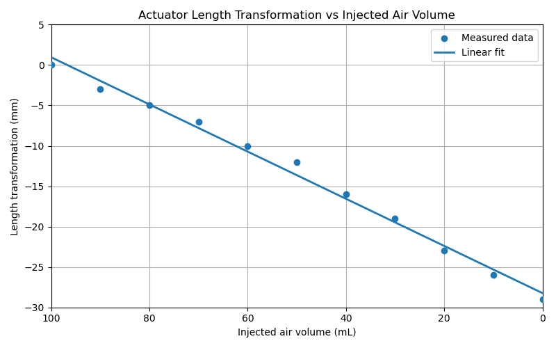
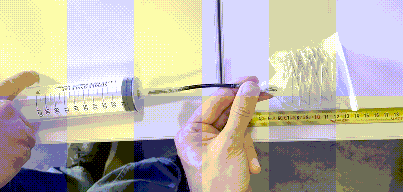
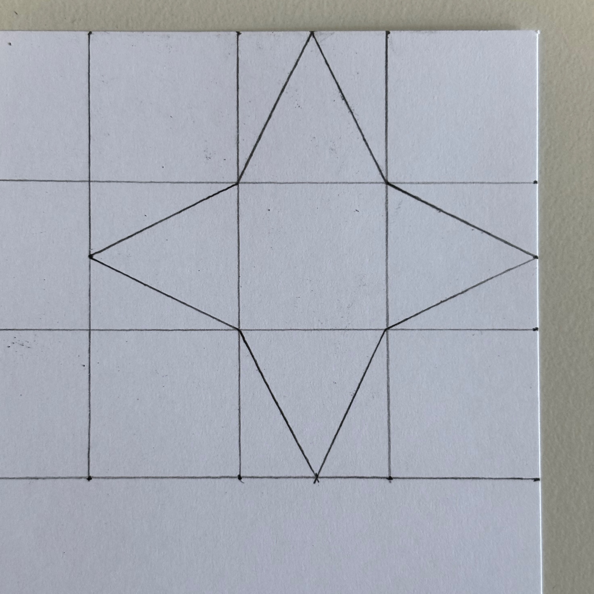
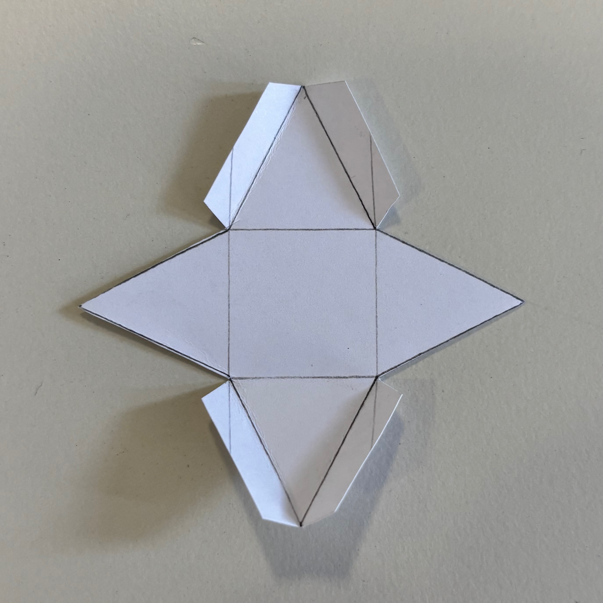
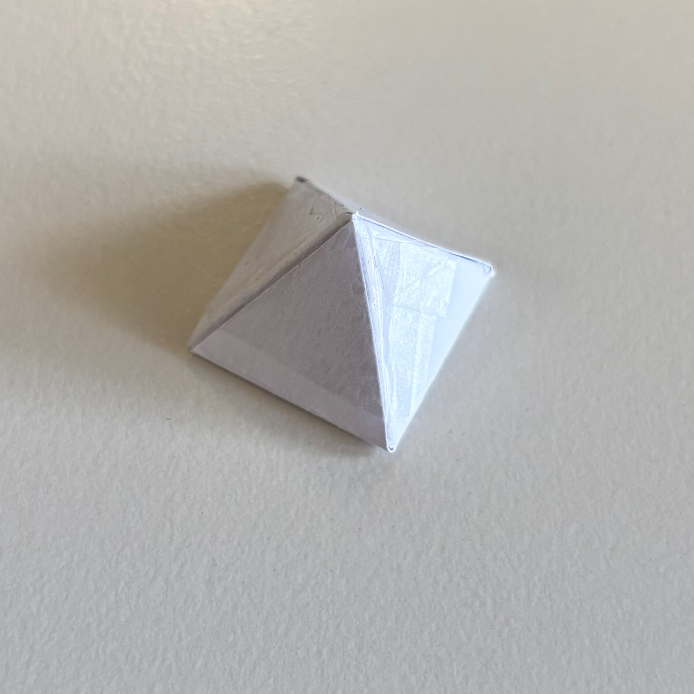
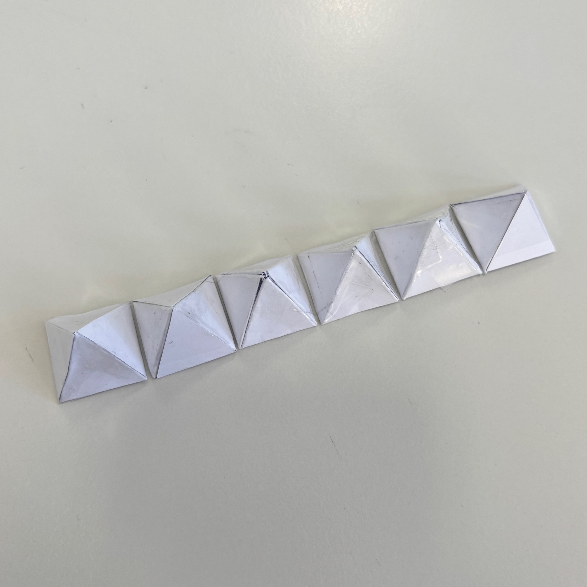
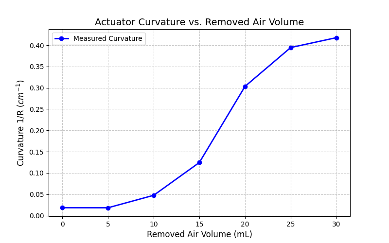
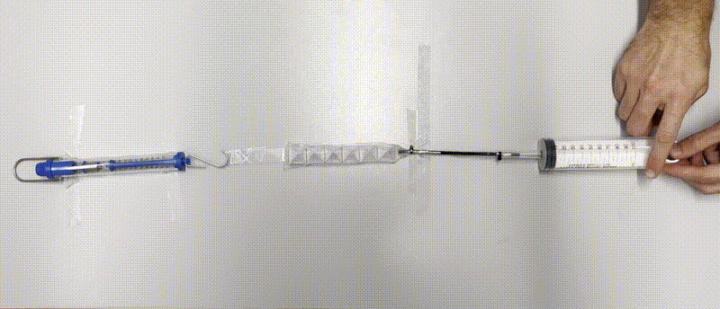
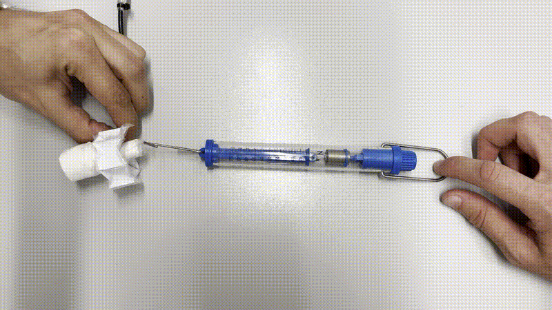
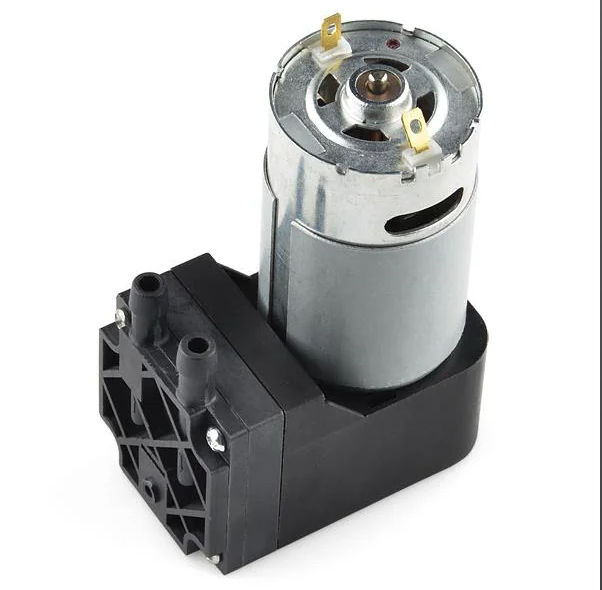

# Humanoid Sensors and Actuators
## Group 5
| Name | Matr. # | Email |
|------|---------|-------|
| Samuele Ribaudo | 03821248 | samuele.ribaudo@tum.de |
| Hong Yan Jun  | 03813507 | go75kes@mytum.de |
| Alessandro Canalicchio | 03796273 | go73xix@mytum.de |
| Niklas Peter | 03812287 | n.peter@tum.de |
| Emile Gebrael | 03812968 | emile.gebrael@tum.de |

We recomend viewing this report [here con GitHub ↗](https://github.com/samuele-ribaudo/humanoid-sensors-and-actuators/tree/main/T3), or with a markdown viewer.

# Tutorial 3 - Part 1


Course Instructors: Dr. Florian Bergner
hsa-lecture.ics@xcit.tum.de

Summer Semester 2026

## 1 Introduction
### 1.1 Introduction to origami and its engineering applications
Origami is the traditional Japanese art of paper folding, and it has inspired a wide range of engineering applications. One of the most well-known examples is the Miura-ori fold, which has been applied to deployable space structures such as solar panels and antennas. These structures can be folded compactly for transportation and then deployed efficiently in space, as shown in Figure 1. In the field of soft actuators, many researchers have explored origami-inspired structures to achieve programmable deformation. One representative example is the Tachi-Miura Polyhedron (TMP) fold. In this tutorial, you will fabricate a simple origami-inspired soft actuator using paper and a plastic bag based on this concept.

### 1.2 Outline of the tutorial
In Tutorials T3.1 and T3.2, you will design, fabricate, and evaluate a simple origami-inspired vacuum actuator using paper and plastic bags. In T3.1, you will focus on the fabrication process, including folding the paper into the desired shape and assembling the actuator. In T3.2, you will evaluate the deformation of the fabricated actuator by applying a vacuum and measuring its linear displacement and force output.

After completing T3.2, you are expected to submit a report describing the fabrication process, the challenges you encountered, and the results of your actuator testing in both T3.1 and T3.2. Throughout the tutorial, you will also find several questions. Your report will be graded based on the quality of your answers and the clarity of your explanations.


***Figure 1*** Deployment of a solar sail [1]. (1) After separating from the launch rocket, four weights attached to the corners of the square sail are released simultaneously. (2) The struts holding down the wrapped sail slide little by little, and the sail is gradually pulled out by centrifugal force. When fully extended, the sail forms a cross shape. (3) When the struts are flattened down, the folded sail is released and expands quickly due to centrifugal force. (4) The sail retains its expanded square shape by maintaining the rotation after deployment. Photos: Courtesy of JAXA.

### 1.3 Materials
In this tutorial, the following materials will be used.

To be provided by the students:
1. Adhesive tape
2. Paper glue
3. Scissors
4. Ruler (10 cm to 30 cm)

To be provided by the instructor:
1. A6-size paper sheets with a printed crease pattern for the origami fold
2. Plastic bags
3. Syringes for vacuum generation
4. Connectors to interface the syringe with the plastic bag
5. Cable ties
6. Force gauge for testing actuator performance


## 2 Fabrication of the origami-inspired vacuum actuator
### 2.1 Paper folding and assembly
You will receive an A6-size paper sheet with a printed crease pattern for the Tachi-Miura Polyhedron (TMP) fold, as shown in Figure 2.


***Figure 2*** Tachi-Miura Polyhedron (TMP) fold pattern. The red lines and blue lines indicate mountain folds and valley folds, respectively.

Please follow the folding procedure shown in Figure 3.
1. Fold all straight creases in a zigzag pattern.
2. Make all diagonal creases mountain folds, then reverse them into valley folds. After that, flatten the sheet once.
3. Starting from the top, fold the Miura-fold unit cells along one edge.
4. Fold the other side in the same way to complete one sheet.
5. Make two sheets and glue them together with paper glue to form a 3D structure.

### 2.2 Plastic bag covering and tube connection
To make the origami structure airtight so that it can function as a vacuum actuator, it must be covered with a plastic bag.

Please follow the steps below:

1. Place the origami structure inside the plastic bag.
2. Seal the plastic bag tightly to ensure airtightness.
3. Make a small hole in the plastic bag and insert an air tube.
4. Use cable ties to secure the tube in place and prevent air leakage.
5. Connect the other end of the tube to a syringe for vacuum generation.


***Figure 3*** Folding procedure for the Tachi-Miura Polyhedron.

**Questions**

* **(2 points)** Take a picture (`acturator.png`) of your fabricated origami-inspired vacuum actuator and explain the folding process you followed.
```text
We followed the Tachi-Miura Polyhedron (TMP) fold pattern. First the folded the paper in a spring-like shape along the vertical folds and then we folded the diagolan creases to obtain the desierd shape.
```


* **(3 points)** What challenges did you encounter during the fabrication process, and how did you overcome them?
```text
A paper ripped, so we have to take a new one.
It was hard to fold along the diagonal lines. We pre-creased the paper alog the blue and red diagonal lines and then we started to follow the mountain and valley folds pattern.
The bag was inflating, but the paper was not moving. Therefore we used some tape to connect the ends of the orgigmai structure to the bag.
```
* **(5 points)** Assuming that the paper sheet is sufficiently stiff to be treated as a rigid plate, how many degrees of freedom does the Tachi-Miura Polyhedron (TMP) fold have? Explain your reasoning.
```text
The Tachi-Miura Polyhedron fold has 1 degree of freedom. Once one fold angle is chosen, all other folds are determined by the geometric constraints, so the entire structure moves with a single independent motion.
```
* **(5 points)** Describe the advantages of using origami-inspired designs in engineering
applications such as satellite structures and soft actuators.
```text
They allow structures to be compact and deployable, which is useful for satellite solar panels and space structures that must fit into small launch volumes and then expand in space. They also provide lightweight and efficient designs while maintaining strength and flexibility. In soft actuators and robotics, origami patterns enable controlled motion, flexibility, and adaptability, allowing devices to bend, fold, and change shape easily without complex mechanisms.```
```

## 3 Testing the actuator deformation

In this part, you will measure the linear displacement of the fabricated origami-inspired vacuum actuator when a vacuum is applied. Before starting the experiment, first remove the air from the plastic bag using the syringe. Then inject 100 mL of air into the bag as the initial condition. After that, gradually remove the air from the bag while measuring the linear displacement of the actuator using a ruler or a cutting mat.

**Questions**

* **(3 points)** Describe the measurement setup you used to evaluate the actuator deformation, including how you applied the vacuum and how you measured the linear displacement.
```text
We used an even underground for both the measuring ruler and the structure in the airbag. At the beginning, after 100 mL of air was injected into the actuator, the front end of the actuator was ending at 10 cm. To ease the reading process, we taped a piece of paper flat to the tip of the actuator. Since the paper is very thin, it gives a precise reading of the ruler.

The air was then pulled back out in 10 mL intervals, and after each interval, the updated measurement was taken and subtracted by the starting 10 cm. This results in the total decrease for each step.

```

* **(5 points)** Plot the relationship between the volume of air removed from the bag and the linear displacement of the actuator. What trend do you observe, and how does it relate to the design of the origami structure?



```text
The measured linear displacement over the injected volume of air follows a linear trend -> More Air leads to longer actuator.
When in vacuum, all areas of the paper lie normal to the length. When vacuum is applied to the actuator, the paper segments begin to tilt. As the vacuum increases, this alignment also does, thereby contributing to the overall length transformation of the actuator. 
```



* **(7 points)** Based on your measurements, discuss possible improvements to the design of the origami-inspired vacuum actuator to enhance its performance, for example by increasing its linear displacement or force output.
```text
- Optimize the size of the air chamber
- Find a better origami pattern that increases/decreases more in length
- Connect directly to a compressor with less air injection loss
- Achieve better sealing of the chamber
- Stiffer or more durable folding material
- Increase the number of origami units
```

## 4 Design Review

After testing the actuator deformation, you will hold a design review session to discuss the results and possible improvements to the origami-inspired vacuum actuator.

Discuss the following points in your group:

**Questions**
* **(5 points)** Are there any other actuation mechanisms (e.g. in pneumatic) that could be combined with the origami structure to improve the actuator performance?
```text
To improve the design we can add shape memory alloys (SMA) along the creases and add a resistance wire inside the chamber to control its temperature. When heat is applied, the SMA contracts, folding the origami. This would be an improvement to the setup because we can control the actuator by running a current through it, instead of using the bulky vacuum pump setup.

Another idea is switching to a waterproof material and replacing air with an incompressible fluid like water. This would enhance the actuator's performance by providing much higher stiffness and more precise displacement control, as hydraulic systems do not suffer from the pressure fluctuations typical of compressible gases.
```

* **(10 points)** How could bending and twisting deformation be achieved using the origami structure?
```text
Bending and twisting deformation can be achieved by introducing asymmetry into the origami structure or the actuation method.
For bending, one side of the origami actuator can be made to contract more than the opposite side. This can be done by applying different vacuum pressures to separate chambers, changing the fold stiffness on one side, or modifying the crease geometry. As one side shortens more, the structure curves toward that side, producing controlled bending motion similar to a soft robotic arm.
For twisting, the folds can be arranged in a helical or angled configuration so that contraction generates rotational motion. Twisting can also be produced by activating chambers diagonally or unevenly around the structure, causing one side to rotate relative to the other. The amount of twist depends on the fold orientation, material stiffness, and pressure distribution.
```

* **(10 points)** What other origami fold patterns could be applied to the design of soft actuators?
```text
Miura-ori Pattern: A 2D sheet pattern that expands and contracts uniformly in two directions at once. It is used in deployable space structures, and in soft robotics, it's great for flat, expanding artificial muscles.

Kresling Pattern: A cylindrical tower pattern that inherently twists as it is compressed. This is perfect for designing soft actuators that need a rotational just by applying a vacuum.

Yoshimura Pattern: A cylindrical pattern, and it collapses perfectly straight down without any twisting. It is great for pure, stable linear actuation and shock absorption.

Waterbomb Base Pattern: This pattern folds inward and outward radially from a center point. It is highly useful for creating spherical soft grippers that can wrap around and grasp objects.

Flasher Pattern: This pattern allows a large surface to fold concentrically around a central hub. It is ideal for deployable "umbrella-like" mechanisms that deploy outward to encompass an irregularly shaped object.
```

You may also try fabricating and testing actuators with different origami fold patterns in Tutorial T3.2, and compare their results with those of the Tachi-Miura Polyhedron fold.


## References
[1] “Origami techniques applied to space development | december 2021 | highlighting japan.” (), [Online]. Available: https://www.gov-online.go.jp/eng/publicity/book/hlj/html/202112/202112_05_en.html (visited on 05/12/2026).


# Tutorial 3 - Part 2

## 5 Redesign and Fabrication of a Vacuum Actuator

Based on the design review in T3.1, you will now redesign and fabricate a novel origami-inspired vacuum actuator in your group. You may use the same materials as in T3.1; however, you are encouraged to explore different folding patterns, geometries, and configurations in order to achieve different deformation modes and improved performance.

Before fabricating the final actuator, we recommend that you first test your folding pattern using regular paper. After confirming the basic deformation mechanism, you can fabricate the actuator using stiffer paper or other available materials.

### Questions

**(5 points)** Describe the deformation that you expect when a vacuum is applied to your new actuator.

```text
While in the resting position, the baseplates of the pyramids are all aligned, which results in a straight actuator shape. When air is pulled out of the plastic chamber, the pyramids are pulled closer together. This breaks the initial straight alignment and reduces the angle between each pair of neighboring pyramid sides. The smaller this angle becomes, the more the actuator bends toward the direction of the pyramid tips. This curvature will increase until all pyramids sides align and the actuator becomes circular-shaped.
```

**(5 points)** Which geometric parameters define the deformation of your actuator?

```text
In our design, each pyramid has a base width of 2 cm and a slanted side height of 2 cm. This means that, in a cross-section, we get a right triangle with a 1 cm cathetus and a 2 cm hypotenuse. From this geometry, the angle of one pyramid side is 30°, and therefore the angle between two neighboring pyramids at rest is also 60°.

Since we use a total of 6 pyramids, and each neighboring pair has an angle of 60° at rest, the total angle adds up to:

6 x 60° = 360°

If all six angles are fully closed, the accumulated bending over the whole actuator equals 360°, which corresponds to one complete rotation. Geometrically, this means that the actuator can close into a full circle, because a circle also represents a total angle of 360°.
```

**(5 points)** Describe the design of your new actuator, including its folding pattern, geometric configuration, and expected deformation mode. How does this design differ from the actuator fabricated in T3.1?

```text
Type the answer here...
```

<div style="display: flex; gap: 10px;">
  
  
  
  
</div>

**(5 points)** Describe the fabrication process of your new actuator. What challenges did you encounter during fabrication, and how did you overcome them?

```text
The fabrication process was rather straight forward, since it builds upon the idea of having modular chain elements that together then form the actuator. Therefore we only built the single pyramids and used a simple taped connection to fit them together.

One of the inital problems were pyramids with full origami styles, that were quite complicated to fabricate and resulted in a way larger slanted side height relative to the baseplate. This would lead to a rather big actuator with a lot of chain elements to get to the full circle. An improved design was used that has fitting overall dimensions (see 5.2).

The initial gripper actuator only had a total of 4 chain elements, but this resulted in a shortage of the circular shape and therefore we could not pick and hold things at all. We incrementally increased pieces until we ended up with a total of 6 elements.
```

## 6 Evaluation of the Actuator

In addition to the deformation measurement performed in T3.1 (see Section 3), you will evaluate the force output of your actuator using a spring scale. Please note that a spring scale measures force along a single axis and extends when a tensile force is applied.

If your actuator produces bending or twisting motion, you may need to design a simple mechanism that converts this motion into a linear displacement or tensile force measurable by the spring scale. For example, in the case of a twisting actuator, you can attach a string to the end of the actuator and connect it to the spring scale. When the actuator twists, it pulls the string and extends the spring scale, allowing you to estimate the force output. If torque is evaluated, clearly explain how the measured force is converted into torque, including the moment arm used in the calculation.

### Questions

**(5 points)** Plot the relationship between the removed air volume and the deformation of the your original actuator.




**(5 points)** Describe the measurement setup used to evaluate the force or torque output. What challenges did you encounter during the measurement, and how did you overcome them?

```text
Type the answer here...
```

**(5 points)** Plot the relationship between an input parameter and the force or torque output of the actuator. In addition, describe the reason that you chose the input parameter for this analysis.




```text
Type the answer here...
```




## 7 Summary

In this tutorial, you designed and fabricated an origami-inspired vacuum actuator using paper and plastic bags. You then evaluated the deformation and force output of your actuator by applying a vacuum and measuring its displacement and force output. Through this process, you learned about the design and fabrication of soft actuators, as well as the practical challenges involved in their experimental evaluation. You also explored how actuator geometry, folding patterns, material properties, and measurement methods influence actuator performance.

### Questions

**(5 points)** If you could replace one of the materials used in this tutorial with a commercial product, what would be worth purchasing? Describe the product and explain how it could improve the actuator performance or the evaluation process.
*Hint: E-commerce platforms such as RS, Conrad and Amazon*


```Link: https://eu.mouser.com/ProductDetail/SparkFun/ROB-10398?qs=WyAARYrbSnaW%252B0ieELD1FQ%3D%3D```
```text
Use a small vacuum pump that can produce a stronger and more controlled vacuum for more reliable actuator movement.
How it works: When 12V are applied to the pump, an internal motor starts moving a flexible membrane back and forth. Through this movement, air is sucked in from the chamber and pushed out through the other side of the pump. This creates a negative pressure inside the actuator chamber. By controlling the electrical signal, for example by switching the pump on and off or by using PWM, the vacuum could be adjusted much more precisely.
```

**(5 points)** Reflecting on the design, fabrication, and evaluation process, what did you find most challenging? How did you overcome these challenges, and what would you do differently if you repeated this tutorial?

```text
It was hard to understand the attributes of the origami structure that make up for a good and effective actuator. Because even if the materials are better but the design is very bad, the actuator will not work well. However, the material and general quality of the actuator also contribute to the effectiveness.

If we had to redo the tutorial, we would try to understand the different possible structures more deeply first and thinking what usecase they are good for and if it aligns with what we plan to do.
```
