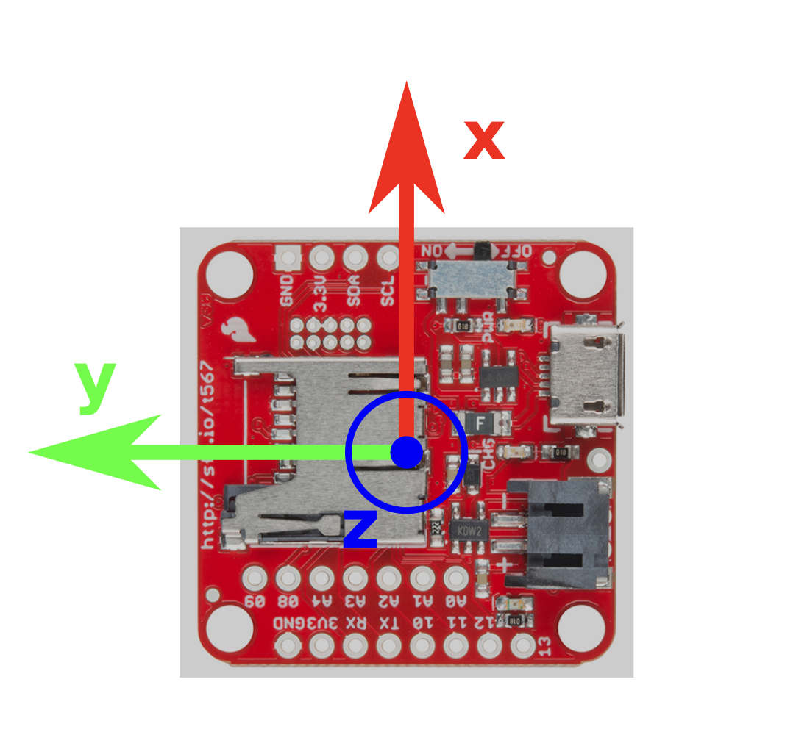
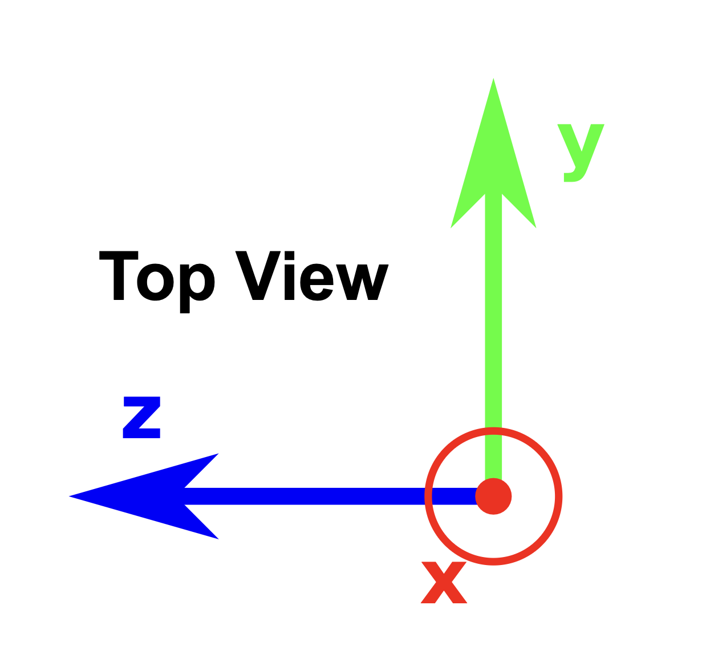

# Humanoid Sensors and Actuators
## Group 5
| Name | Matr. # | Email |
|------|---------|-------|
| Samuele Ribaudo | 03821248 | samuele.ribaudo@tum.de |
| Hong Yan Jun  | 03813507 | go75kes@mytum.de |
| Alessandro Canalicchio | 03796273 | go73xix@mytum.de |
| Niklas Peter | 03812287 | n.peter@tum.de |
| Emile Gebrael | 03812968 | emile.gebrael@tum.de |

We recomend viewing this report [here con GitHub ↗](https://github.com/samuele-ribaudo/humanoid-sensors-and-actuators/tree/main/T4), or with a markdown viewer.

# Tutorial 4 - Part 1

Course Instructors: Dr. Florian Bergner
hsa-lecture.ics@xcit.tum.de

Summer Semester 2026

## Inertial Measurement Unit (IMU) (41 points)
In this tutorial we work with the data taken from a Sparkfun 9DOF Razor IMU. This IMU integrates a 3D accelerometer, a 3D gyroscope and a 3D magnetometer. The accelerometer measures the linear, centripetal, Coriolis, and the earth gravitational acceleration, the gyroscope measures angular velocities around the coordinate axes, and the magnetometer measures the magnetic flux of the earth magnetic field.

In this tutorial we will learn:
- How to calibrate 3D sensors (accelerometer, gyroscope, magnetometer)

<div align="center">
  
</div>

Figure 1: IMU with the axes of the base coordinate system 0. We will use the homogeneous transformations $^{acc}_0\mathbf{T}$, $^{gyro}_0\mathbf{T}$, and $^{mag}_0\mathbf{T}$ to transform the measurements of the sensors to this common coordinate frame.

## Preparation – Cloning the tutorial project

All the measurements and Matlab scripts for this tutorial can be found in one common project. You can download this project by cloning:

```bash
git clone "https://gitlab.lrz.de/hsa/students/matlab-hsa-imu-tut.git"
```

This project has been extensively tested with `Matlab2020b` and should work out of the box. To source the libraries of the project, run once the script `setup.m`. The sections in the Matlab code that you will modify during this tutorial are marked with a line of question marks `???...???`. To ensure that you are not accidentally modifying code that should not be touched and to avoid breaking your whole project please only modify code between two lines of these question marks. The marked section additionally contains instructions and implementation hints. Please read them carefully. They will help you to save time in your implementations.

## 1 Accelerometer Calibration (41 points)

The accelerometer calibration incorporates:

* Determining the transformation $^{acc}_0\mathbf{T}$ of the accelerometer coordinate frame with respect to (wrt.) the base coordinate frame 0.
* Determining the measurement offset with respect to all three axes.
* Determining the measurement gain with respect to all three axes.

We furthermore assume that the accelerometer's coordinate axes are orthogonal to each other and that the axes are aligned to the sensor module. That is, $^{acc}_0\mathbf{T}$ only maps coordinate axes and changes their directions, e.g. all rotations are dividable by 90 deg.

### 1.1 Determining the transformation between the accelerometer and the base frame (5 points)

To determine the orientations of the accelerometer’s coordinate axes with respect to the base frame (coordinate system 0, see Figure 1), we measure the gravitational acceleration by aligning it to the axes of the base frame 0. Then the accelerometer should measure the full magnitude of the gravitational acceleration along one coordinate axis, while the magnitudes along the other axes should be approximately zero.
These measurements are stored in the following Matlab data files:

* negative $x$-axis along the gravitational acceleration: `accXn.mat`
* positive $x$-axis along the gravitational acceleration: `accXp.mat`
* negative $y$-axis along the gravitational acceleration: `accYn.mat`
* positive $y$-axis along the gravitational acceleration: `accYp.mat`
* negative $z$-axis along the gravitational acceleration: `accZn.mat`
* positive $z$-axis along the gravitational acceleration: `accZp.mat`

and can be found in the project folder `data`. For example, in `accXn.mat` we aligned the negative $x$-axis along the gravitational acceleration, see Figure 2.

<div align="center">
  
  
  Figure 2: The axes of the base frame for measurement `accXn.mat`.
</div>

Open the Matlab script `main_acc_directions.m`. Find the sections that have been marked and require your inputs. This script loads all the measurements of the experiments `accXn.mat` etc. and prints out the matrix $^{acc}_0\mathbf{T}$ and the gravitational accelerations for all the experiments.

**T.1.1 (3 points)** Until you modify the script, $^{acc}_0\mathbf{T}$ is initialized to identity. Please run the script, inspect the print outs and determine $^{acc}_0\mathbf{T}$.

**T.1.2 (2 points)** The script should print out the acceleration measurements wrt. the base frame. Use the marked section to expand the measurements to homogeneous coordinates and transform them to the base frame 0. When $^{acc}_0\mathbf{T}$ of **T.1.1** is correct the print outs should match your expectations.

Please submit `main_acc_directions.m` containing your modifications for **T.1.1** and **T.1.2**.

```matlab
paste here the matlab implementation of main_acc_directions.m
```

[See main_acc_directions.m ↗](code/main_acc_directions.m)

### 1.2 Calibrating the accelerometer (26 points)

To calibrate the accelerometer we have to find its offset and gain parameters. We will incorporate these gains and offsets into a homogeneous transformation matrix $^{raw}_{acc}\mathbf{T}$ that transforms the uncalibrated raw measurements of the accelerometer to calibrated measurements in the coordinate frame of the accelerometer.

$$_{acc}\mathbf{x} = {^{raw}_{acc}\mathbf{T}} \cdot {_{acc}\mathbf{x}_{raw}} $$

We determine the gains and offsets of the accelerometer by employing the ellipsoid fitting method introduced in lecture **L4**. The ellipsoid fitting delivers the model matrix $\mathbf{M}$ containing the gains $g_i$ and the rotations of the coordinate axes $\mathbf{R}$

$$\mathbf{M} = \text{diag}(g_1, g_2, g_3)\mathbf{R} $$

and the offset vector $\mathbf{w}$. Because of the Singular Value Decomposition (SVD) the rotation matrix $\mathbf{R}$ is usually not the identity matrix. Therefore, this rotation has to be compensated for to get $^{raw}_{acc}\mathbf{T}$.
Open the Matlab script `main_acc_calib.m`. Find the sections that have been marked and require your inputs. This script loads several experiments to provide measurements of the gravitational acceleration in many different poses. The script displays the loaded data, performs the calibration by calling the function `accCalib.m` and finally applies the calibration to the measurements for validation. You will implement the calibration algorithm in the marked section of `accCalib.m`.

**T.1.3 (2 points)** We assume that $\mathbf{R}$ is constrained to rotations that are dividable by 90 degrees, i.e. the axes of the ellipsoid are aligned to the coordinate axes of the accelerometer but could be flipped or mapped differently. E.g. the $x$-axis of the ellipsoid could be mapped to the negative $z$-axis of the accelerometer. This constraint simplifies $\mathbf{A}_{fit}$. Then, how many parameters do you need for $\mathbf{A}_{fit}$? Please explain.

```text
type here the answer...
```

**T.1.4 (2 points)** What parameters (A, B, ..., K) of the approximated ellipsoid matrix A_tilde become zero? Please explain.

```text
type here the answer...
```

**T.1.5 (8 points)** Implement the calibration algorithm discussed in the previous lecture **L4** in `accCalib.m`. Please add comments where necessary.

```matlab
paste here the matlab implementation of accCalib.m
```

**T.1.6 (2 points)** Use the results of **T.1.5** and compose the transformation $^{e}_{0}\mathbf{T}$ using $\mathbf{R}$ and $\mathbf{w}$ in the marked section of `main_acc_calib.m`. $^{e}_{0}\mathbf{T}$ represents the coordinate system of the ellipsoid wrt. the base frame 0.

```matlab
paste here this part of the matlab implementation of main_acc_calib.m
```

**T.1.7 (4 points)** Use the results of **T.1.5** and compose the homogeneous model matrix $\mathbf{T}_m$ using $\mathbf{R}$ and $\mathbf{G}$ in the marked section of `main_acc_calib.m`. $\mathbf{T}_m$ only contains the gains of the calibration and does not rotate the coordinate axes. Thus $\mathbf{T}_m$ is approximately diagonal. Note that it is in general not sufficient to just paste $\mathbf{G}$ into $\mathbf{T}_m$.

```matlab
paste here this part of the matlab implementation of main_acc_calib.m
```

**T.1.8 (2 points)** Use the results of **T.1.5** and compose the homogeneous offset matrix $\mathbf{T}_w$ using $\mathbf{w}$ in the marked section of `main_acc_calib.m`. $\mathbf{T}_w$ only contains a translation.

```matlab
paste here this part of the matlab implementation of main_acc_calib.m
```

**T.1.9 (2 points)** Use the results of **T.1.7** and **T.1.8** and compute $^{raw}_{acc}\mathbf{T}$ by concatenating $\mathbf{T}_m$ and $\mathbf{T}_w$ in the marked section of `main_acc_calib.m`. First apply the translation, then the scaling.

```matlab
paste here this part of the matlab implementation of main_acc_calib.m
```

**T.1.10 (2 points)** Implement Equation 1 in the marked section of `main_acc_calib.m`. Check in the print out how much your calibration improves. This gives you some feedback if your calibration is correct.

```matlab
paste here this part of the matlab implementation of main_acc_calib.m
```

**T.1.11 (2 point)** Finally, use $^{raw}_{acc}\mathbf{T}$ and $^{acc}_{0}\mathbf{T}$ to calibrate and transform the raw measurements to the base frame 0 in the marked section of `main_acc_calib.m`. The script loads the measurements of the gravitational accelerations aligned to the different coordinate axes. You can verify if the print outs match your expectations.

```matlab
paste here this part of the matlab implementation of main_acc_calib.m
```

Please submit `main_acc_calib.m` and `accCalib.m` containing your modifications for **T.1.3** to **T.1.11**.

[See accCalib.m ↗](code/accCalib.m)
[See main_acc_calib.m ↗](code/main_acc_calib.m)


### 1.3 Report (10 points)

**R.1.1 (2 points)** How many different poses do we need at least to get a good set of parameters for the implemented calibration algorithm?

```text
type here the answer...
```

**R.1.2 (2 points)** Why should linear accelerations be minimized while capturing data for the calibration? Explain and elaborate.

```text
type here the answer...
```

**R.1.3 (1 points)** How do you minimize linear accelerations?

```text
type here the answer...
```

**R.1.4 (1 points)** How do you minimize the influence of linear accelerations during calibration?

```text
type here the answer...
```

**R.1.5 (4 points)** Describe and explain the mathematical trick we use to get the model matrix $\mathbf{M}$ from a properly scaled ellipsoid matrix $\mathbf{A}_{fit}$. Explain! Copying the formulas from the lecture script is NOT enough.

```text
type here the answer...
```


# Tutorial 4 - Part 2 (Bonus)

## E-Skin (26 points)

This tutorial is centered around the e-skin we develop at ICS. We will exploit its accelerometers and neighbor information to reconstruct the 3D surface a skin patch covers.

In this tutorial we will learn:

* How to estimate rotations between skin cells solving the Procrustes Problem.
* How to compute the poses of the skin cells with respect to a common reference frame.

## Preparation – Cloning the tutorial project

All the measurements and Matlab scripts for this tutorial can be found in one common project. You can download this project by cloning:

```bash
git clone "https://gitlab.lrz.de/hsa/students/matlab-hsa-skin-tut.git"
```

This project has been extensively tested with `Matlab2020b` and should work out of the box. To source the libraries of the project, run once the script `setup.m`. The sections in the Matlab code that you will modify during this tutorial are marked with a line of question marks `???...???`. To ensure that you are not accidentally modifying code that should not be touched and to avoid breaking your whole project please only modify code between two lines of these question marks. The marked section additionally contains instructions and implementation hints. Please read them carefully. They will help you to save time in your implementations.

## 1 3D Surface Reconstruction (18 points)

The *Procrustes* problem is a matrix approximation problem where we want to find an orthogonal matrix $\mathbf{R}$ which maps a matrix $\mathbf{A}$ to a matrix $\mathbf{B}$. We can use the solution of the *Procrustes* problem to determine a rotation matrix $\mathbf{R}$ between two sets of vectors in the matrices $\mathbf{A}$ and $\mathbf{B}$. To get a rotation matrix, the mapping between $\mathbf{A}$ and $\mathbf{B}$ needs to be constrained to rotation matrices. This can be enforced by forcing the determinant of $\mathbf{R}$ to one. We can calculate the rotation matrix in the following way:

$$\mathbf{A} = \begin{bmatrix} \mathbf{a}_1 & \dots & \mathbf{a}_n \end{bmatrix} \in \mathbb{R}^{3 \times n} \qquad \mathbf{B} = \begin{bmatrix} \mathbf{b}_1 & \dots & \mathbf{b}_n \end{bmatrix} \in \mathbb{R}^{3 \times n} $$

$$\mathbf{M} = \mathbf{B}\mathbf{A}^\top \in \mathbb{R}^{3 \times 3} \qquad \mathbf{M} = \mathbf{U}\mathbf{\Sigma}\mathbf{V}^\top $$

$$\mathbf{\hat{\Sigma}} = \begin{pmatrix} 1 & 0 & 0 \\ 0 & 1 & 0 \\ 0 & 0 & \text{sign}(\text{det}(\mathbf{U}\mathbf{V}^\top)) \end{pmatrix} $$

$$\mathbf{R} = \mathbf{U}\mathbf{\hat{\Sigma}}\mathbf{V}^\top $$

Open the Matlab script `main_patch.m`. This script loads all the required data, calls the `calcposes.m` function that implements a brute force 3D reconstruction algorithm, and visualizes the skin cell map, the reference skin patch and the skin patch resulting from `calcposes.m`. You will find sections that have been marked and require your inputs in the functions `calcposes.m` and `estRot.m`.

**T.1.1 (8 points)** Implement the solution to the *Procrustes* problem in the marked section of `estRot.m`. Please add comments where necessary.

```matlab
paste here the matlab implementation of estRot.m
```

**T.1.2 (2 points)** Compute the calibrated accelerations measured in different poses for the root cell of the patch in the marked section of `calcposes.m`. Use the provided homogeneous calibration matrix that compensates gain and offset errors.

```matlab
paste here this part of the matlab implementation of calcposes.m
```

**T.1.3 (2 points)** Compute the calibrated accelerations measured in different poses for the currently evaluated neighbor cell in the marked section of `calcposes.m`. Use the provided homogeneous calibration matrix that compensates gain and offset errors.

```matlab
paste here this part of the matlab implementation of calcposes.m
```

**T.1.4 (2 points)** Feed the function implemented in **T.1.1** with the correct accelerations and acquire the rotation of the currently evaluated neighbor cell with respect to the root cell in the marked section of `calcposes.m`.

```matlab
paste here this part of the matlab implementation of calcposes.m
```

**T.1.5 (4 points)** Use the pose of the root cell, the rotation of the currently evaluated neighbor cell, and the port vectors of both cells to compute the position of the neighbor cell wrt. the common reference frame in the marked section of `calcposes.m`. Validate your results. The visualization of both patches should look identical.

```matlab
paste here this part of the matlab implementation of calcposes.m
```

Please submit `calcposes.m` and `estRot.m` containing your modifications for **T.1.1** to **T.1.5**.

[See estRot.m ↗](code/estRot.m)
[See calcposes.m ↗](code/calcposes.m)


### 1.1 Report (8 points)

**R.1.1 (4 points)** How many poses are needed to reliably determine the rotation matrix? Elaborate and explain.

```text
type here the answer...
```

**R.1.2 (4 points)** How do the singular values relate to an under defined, partially defined, fully defined, and over defined solution for the rotation matrix? Elaborate and explain. Just copying the results of a paper is NOT enough. Also describing the general meaning of the singular values is not sufficient. Please specifically explain how the singular values impact the reconstruction result.

```text
type here the answer...
```