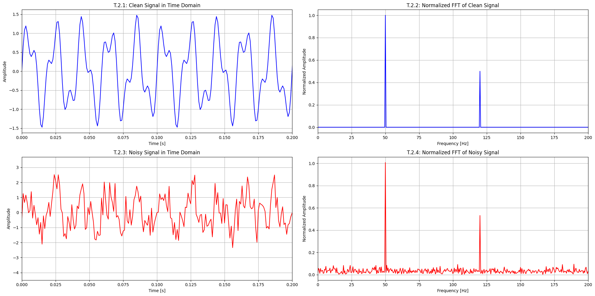
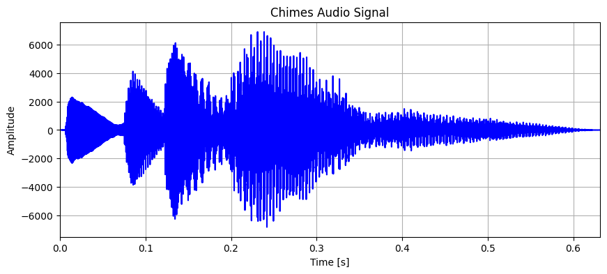
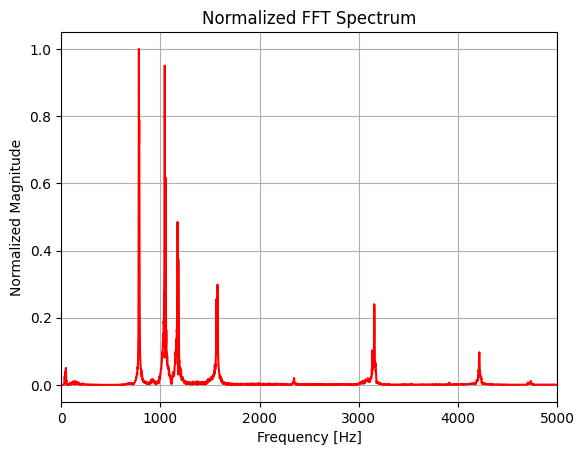
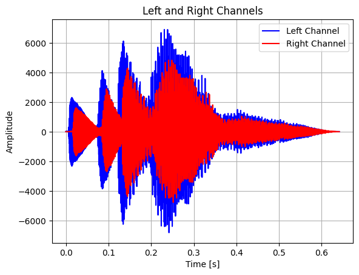
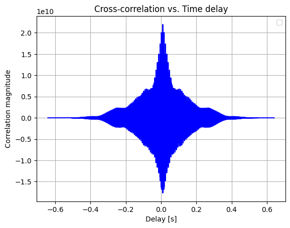
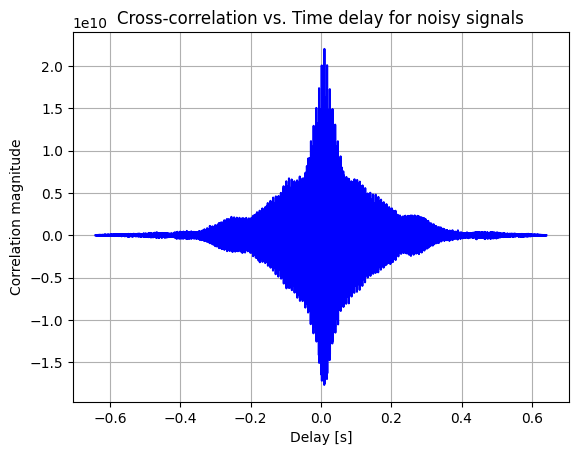
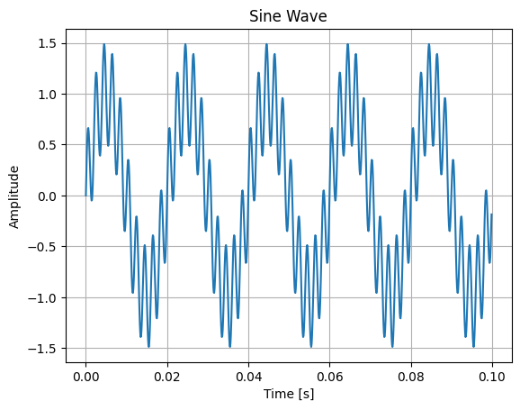
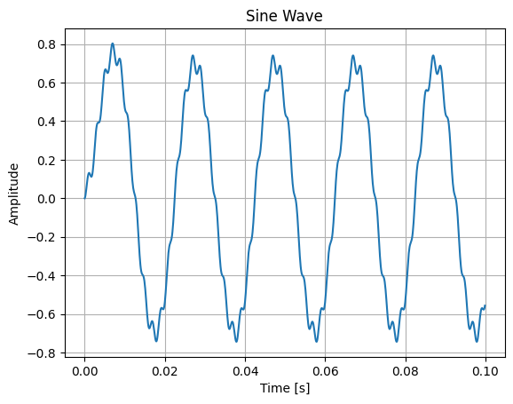
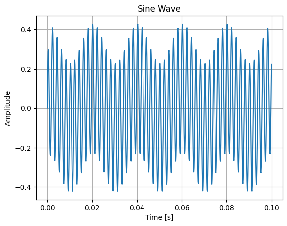
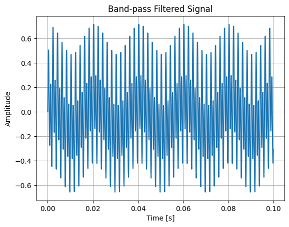

# Humanoid Sensors and Actuators
## Group 5
| Name | Matr. # | Email |
|------|---------|-------|
| Samuele Ribaudo | 03821248 | samuele.ribaudo@tum.de |
| Hong Yan Jun  | 03813507 | go75kes@mytum.de |
| Alessandro Canalicchio | 03796273 | go73xix@mytum.de |
| Niklas Peter | 03812287 | n.peter@tum.de |
| Emile Gebrael | 03812968 | emile.gebrael@tum.de |

We recomend viewing this report [here con GitHub ↗](https://github.com/samuele-ribaudo/humanoid-sensors-and-actuators/tree/main/T5), or with a markdown viewer.

# Tutorial 5

Course Instructor: Dr.-Ing. J. Rogelio Guadarrama Olvera
hsa-lecture.ics@xcit.tum.de

Summer Semester 2026

## Acoustic Sensors and Signal Processing (57 points)

In this tutorial we will refresh some basics of signal processing including correlation, Fast Fourier Transform (FFT) and filtering. All tasks are solvable with Python, Matlab, Octave or Scilab with a slightly varying syntax.

**Note:** You may use any of the above programming languages. However, we strongly recommend using Jupyter Notebooks (python) to solve and visualize all the tutorial. We will only support installation/setup questions related to python.

## 1 Sound Source Localization (8 points)

### Report

**R.1.1 (3 points)** Find the expression to determine the azimuth angle of a sound source for a system with two microphones. Derive the equations shown in the slides of Lecture 3 step by step.

1. Calculate the path length difference using the speed of sound $c$ and the time delay $\Delta t$[cite: 2]:
$$\text{Distance}=c\Delta t$$

2. Determine the geometric extra distance the sound travels to the further microphone using trigonometry[cite: 2]:
$$\text{Distance}=l\sin\theta$$

3. Equate the two expressions representing the same distance[cite: 2]:
$$l\sin\theta=c\Delta t$$

4. Divide both sides by $l$ to isolate the angle expression[cite: 2]:
$$\sin\theta=\frac{c\Delta t}{l}$$

**R.1.2 (3 points)** Find the expression to determine the velocity of a target from the pulse duration difference of a radar sensor. Derive the equations shown in the slides of Lecture 3 step by step.

1. Start with the base formula for the Doppler frequency shift $\Delta f$ given the emitted frequency $f_0$[cite: 2]:
$$\Delta f=\frac{2\Delta v}{c}f_0$$

2. Multiply both sides by the wave propagation speed $c$[cite: 2]:
$$c\Delta f=2\Delta vf_0$$

3. Divide both sides by $2f_0$ to isolate the velocity variable $\Delta v$[cite: 2]:
$$\Delta v=\frac{c\Delta f}{2f_0}$$

**R.1.3 (1 point)** How can we measure the distance to a target?

We can measure distance using the time-of-flight principle by calculating the time delay between an emitted signal and its returning echo

**R.1.4 (1 point)** How can we measure the speed of a moving target?

We can measure the speed of a moving target by using the Doppler effect to analyze the frequency shift between an emitted wave and its returning echo.

## 2 Fast Fourier Transform (8 points)

### Tasks

**T.2.1** Create a signal consisting of the sum of two sine waves using a sample frequency of 1000Hz, one with amplitude of 1 and frequency of 50 Hz and the other with amplitude 0.5 and frequency 120 Hz. Plot the signal over a time slot of 2s.

```python
# type here the code...
```


**T.2.2** Run a FFT (Fast Fourier transform) on the signal from T.2.1 and plot it. Normalize the output to 1 and only show positive frequencies.

```python
# type here the code...
```


**T.2.3** Add random noise to the signal from T.2.1 and plot the signal again.

```python
# type here the code...
```


**T.2.4** Run the FFT on the noisy signal from T.2.3 and plot it.

```python
# type here the code...
```



### Report

**R2.1 (2 points)** Is it possible to implement FFT to an online data streaming? Why?

```text
Type here the answer...
```

**R2.2 (2 points)** How can you use FFT in signal processing?

```text
Type here the answer...
```

**R2.3 (2 points)** Deliver the code used to generate the signals and plots?

```python
# type here the code...
```

## 3 Audio Correlation (8 points)

### Tasks

**T.3.1** Load the ‘chimes.wav’ file into the workspace and isolate one of its channels.

- Plot the signal with a reasonable time scale.
- If you have speakers/headphones: try to output the audio signal.

```python
# type here the code...
```



**T.3.2** Run an FFT on the audio signal from T.3.1 and plot it.

```python
# type here the code...
```



**T.3.3** Generate a left and a right channel from the signal of T.3.1 and add a delay and scaling factor to one of them. Make the delay and scaling factors variable.

```python
# type here the code...
```

**T.3.4** Plot the two signals in the same figure.

```python
# type here the code...
```



**T.3.5** If you have speakers/headphones: listen to the signals and find parameters at which stereo localization works for you.

```python
# type here the code...
```

**T.3.6** Run cross-correlation on both signals and plot the correlation against delay.

```python
# type here the code...
```



**T.3.7** Add noise with a normal distribution to both channels.

```python
# type here the code...
```

**T.3.8** Run cross-correlation on the noisy signals and plot.

```python
# type here the code...
```



### Report

**R.3.1 (2 point)** Is it possible to implement the cross-correlation to an online data streaming? Why?

```text
Type here the answer...
```

**R.3.2 (2 point)** If you answered “no” to R.3.1, how would you work around to use it to identify the interaural time delay?

```text
Type here the answer...
```

**R.3.3 (4 points)** Deliver the code to generate the signals and the plots (T.3.1 - T.3.8).

```python
# type here the code...
```

## 4 Signal Filtering (33 points)

### Tasks

**T.4.1** Create a signal consisting of two sine waves, one with amplitude of 1 and a frequency of 50 Hz and one with amplitude 0.5 and frequency of 500 Hz using a sample frequency of 10,000 Hz.

```python
# type here the code...
```

**T.4.2** Plot the signal over a time slot of 0.1s.

```python
# type here the code...
```



**T.4.3** Design an analog low-pass passive filter with a cut-off frequency of 50 Hz.

```text
Type here the answer...
```

**T.4.4** Design and implement a first order discrete low-pass filter with cut-off frequency of 50 Hz.

```python
# type here the code...
```

**T.4.5** Apply the filter from T.4.4 to the signal created in T.4.1. Plot again the signal after filtering.

```python
# type here the code...
```



**T.4.6** Design an analog high-pass passive filter with a cut-off frequency of 500 Hz.

```text
Type here the answer...
```

**T.4.7** Design and implement a first order discrete high-pass filter with cut-off frequency of 500 Hz.

```python
# type here the code...
```

**T.4.8** Apply the filter from T.4.7 to the signal created in T.4.1. Plot again the signal after filtering.

```python
# type here the code...
```



**T.4.9** Create another sine wave signal with a frequency of 1,000 Hz using a sample frequency of 10,000 Hz. Then, add it to the signal created in T.4.1.

```python
# type here the code...
```

**T.4.10** Design an analog band-pass active filter to recover the 500 Hz signal.

```text
Type here the answer...
```

**T.4.11** Design and implement a discrete band-pass filter to recover the 500 Hz signal from the superposed signal.

```python
# type here the code...
```

**T.4.12** Apply the filter from T.4.11 to the signal created in T.4.9. Plot again the signal after filtering.

```python
# type here the code...
```



### Report

**R.4.1 (2 points)** Detail the design process of the filter in T.4.3. Draw the required circuit and calculate the value for the components step by step.

```text
Type here the answer...
```


**R.4.2 (2 points)** Detail the design process of the filter in T.4.4. Derive the equation to implement the filter step by step on a data stream.

```text
Type here the answer...
```

**R.4.3 (2 points)** Detail the design process of the filter in T.4.6. Draw the required circuit and calculate the value for the components step by step.

```text
Type here the answer...
```


**R.4.4 (2 points)** Detail the design process of the filter in T.4.7. Derive the equation to implement the filter step by step on a data stream.

```text
Type here the answer...
```

**R.4.5 (2 points)** Detail the design process of the filter in T.4.10. Draw the required circuit and calculate the value for the components step by step.

```text
Type here the answer...
```


**R.4.6 (2 points)** Detail the design process of the filter in T.4.11. Derive the equation to implement the filter step by step on a data stream.

```text
Type here the answer...
```

**R.4.7 (2 point)** What is the difference between passive and active filters?

```text
Type here the answer...
```

**R.4.8 (2 point)** What is the difference between FIR and IIR filters?

```text
Type here the answer...
```

**R.4.9 (2 point)** What is the “order” of a discrete filter?

```text
Type here the answer...
```

**R.4.10 (2 point)** How could you implement a continuous-time filter in a robotic system?

```text
Type here the answer...
```

**R.4.11 (2 point)** How could you implement a discrete-time filter in a robotic system?

```text
Type here the answer...
```

**R.4.12 (3 point)** What are the advantages and disadvantages of analog and digital filters in robotic systems?

```text
Type here the answer...
```

**R.4.13 (2 point)** Is it possible to make a 1000 Hz Low-Pass filter in a digital system with a sampling rate of 1000 Hz?

```text
Type here the answer...
```

**R.4.14 (6 points)** Deliver the code to generate the signals and the plots (T.4.1 - T.4.12).

```python
# type here the code...
```
